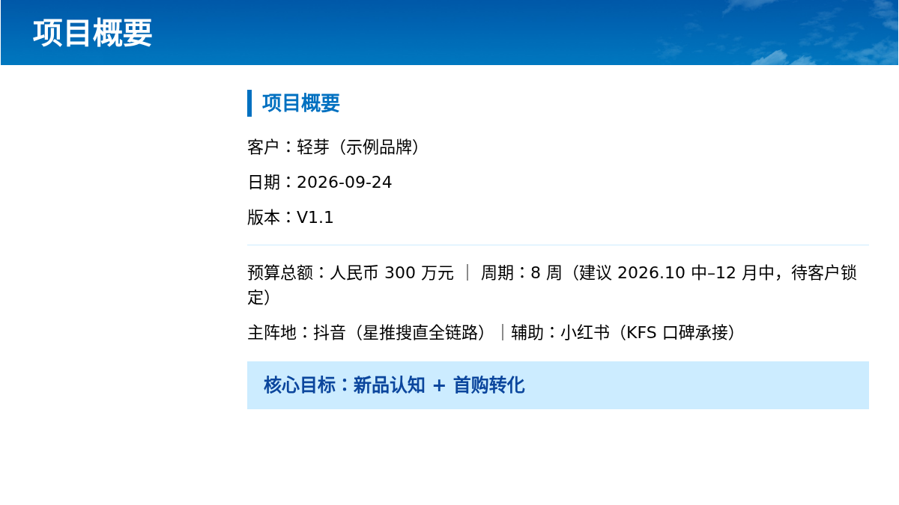
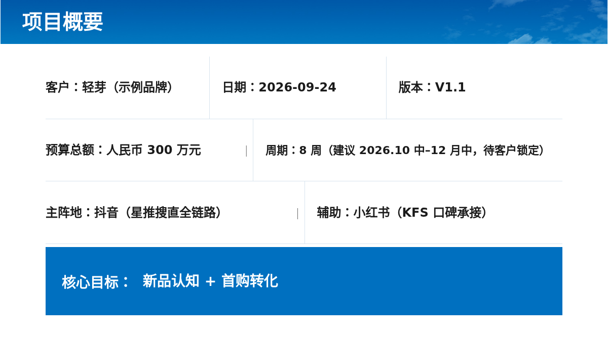
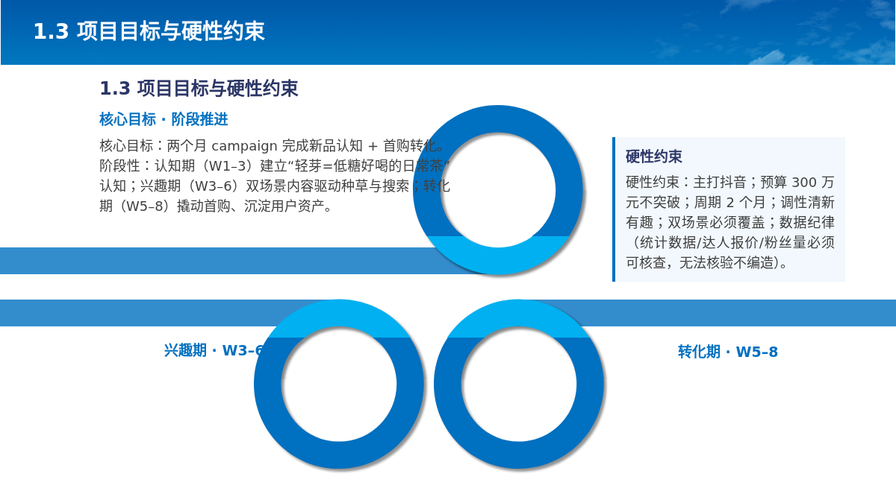
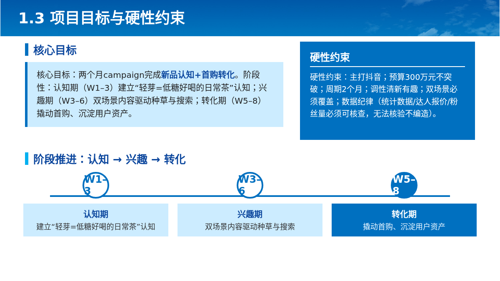
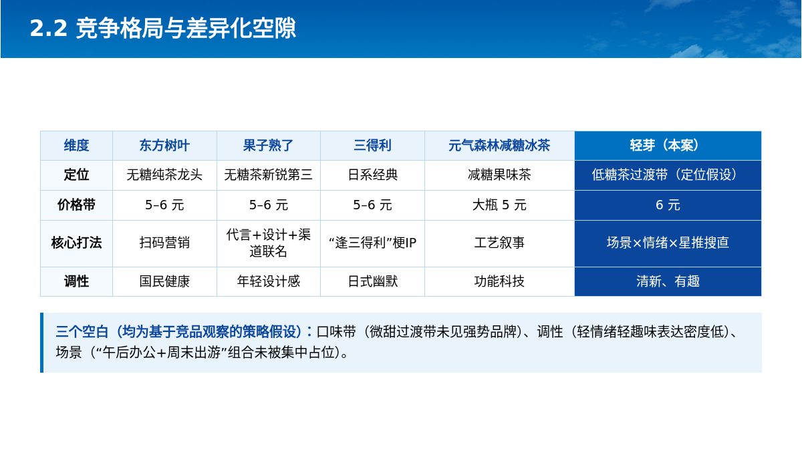

# 实测证据：不能将导出成功等同于高质量

本次交接包刷新时，企业 v5 已部署到 18080，**整体尚未通过成品美观验收**。下列状态均为保存证据的快照，不是实时任务看板。

| 任务 | 当前证据结论 | 文件 |
|---|---|---|
| 历史 56 页 `40bf3188a3bf430fa448a664ed8a4f4f` | 生成已完成，`visual_status=needs_review`；存在标题字号、圆内折行、正文偏右、箭头文字背景问题 | [用户反馈与 DOM 审计](../user-layout-feedback-20260930.md)、[原始审计数据](../user-layout-feedback-20260930.json) |
| v5 新 7 页 `895b39e9fdb846ee8ca151b88fae8b6e` | `status=completed`、`stage=needs_review`、`quality_status=needs_review`、`ready_for_delivery=false`；来源、浏览器及导出版本检查通过，逐页视觉、整册终审和素材未完成 | [任务状态](v5-validation/job.json)、[质量报告](v5-validation/quality-report.json)、[Codex 独立审查](v5-validation/codex-review.json) |
| 用户反馈优化 `bc11692a2bdf4a86a10a3540d5a0a88c` | 第一轮56页通过来源/浏览器/导出版本匹配，视觉与素材未验收；新预算授权后同ID续跑。四页独立截图保留观察时`draft_needs_review`，不替代Seed验收 | [四页截图与观察索引](user-layout-review/README.md)、[观察原文](user-layout-review/codex-observations.md)、[版本和哈希证据](user-layout-review/codex-observations.json) |

人工反馈稳定ID、逐项Seed复验、跨分页问题矩阵和当前版本门禁等最新补强已部署，服务renderer和skill SHA与源码吻合。用户明确授权本地图片/视觉共享总上限从100元调整为200元，图片单独20元及累计账本不变；负责人正重建API环境并从原检查点续跑同一ID。原第7、8、13、20页的改善仅为Codex独立观察，第7页与其余页标题基线约差4.3px、第20页箭头偏扁等仍保留为待复核问题。

最新工程汇总为417项Python通过、1项跳过、Chrome21项通过；前端构建和5种进度状态的真实浏览器mock回归通过，18080真实访问无console error。旧376/17等数字仅为历史阶段记录；所有工程数字均不替代逐页美观证据。续跑结果确定后再更新交接清单与ZIP。

7 页验证截图来自项目 Agent 保存的成品预览：[1](v5-validation/previews/1.png)、[2](v5-validation/previews/2.png)、[3](v5-validation/previews/3.png)、[4](v5-validation/previews/4.png)、[5](v5-validation/previews/5.png)、[6](v5-validation/previews/6.png)、[7](v5-validation/previews/7.png)。各截图 SHA256 与质量报告、独立审查逐页对应。视觉预算不足导致 7 页均未完成项目视觉验收；独立审查另发现第 6 页说明重复、目录多余装饰等问题。Codex 观察没有替代项目模型结论，HTML/PPTX 可导出也不代表验收通过。

以下为历史 56 页试验记录，保留当时的检查与观察；旧时间点的工程测试数量不是本次源码快照的全量测试总数。

2026-09-30，PROJECT / 99162889，原稿56页、52组。优化版本 `40bf3188a3bf430fa448a664ed8a4f4f` 由项目Agent调用GLM及视觉工具产生，Codex没有手写这些幻灯片HTML。此文件夹中的after图片是运行过程截图，不是整册最终验收成品。

## 观察结果

| 页码 | 项目检查情况 | Codex独立看图结论 |
|---|---|---|
| 1 | 优化后通过浏览器与视觉 | 可接受，标题不再拆开“营销” |
| 2 | 优化后通过 | 可接受，装饰序号弱化，正式目录更清楚 |
| 3 | 优化后通过 | 待修：左侧约330px空置，长目录词语断行 |
| 5 | 优化后通过 | 可接受，信息占用合理页宽，重点清楚 |
| 6 | 经浏览器修复后通过 | 待修：蓝色价格卡片中“带”单字换行 |
| 7 | 优化后通过 | 可接受，数值和说明形成主次 |
| 8 | 优化后通过；模型给出两个low问题 | 待修：W1–3等数字区间在圆形节点中断行，不能当作纯偏好 |
| 10 | 本轮自我修正3次后回滚 | 正文容器x=44，合同要求x=60，尚未通过 |
| 11 | 本轮自我修正3次后回滚 | 一个来源块在正文容器之外，尚未通过 |
| 12 | 优化后通过 | 可接受，表格获得完整页宽，重点列明显 |

以上是观察时快照；后续轮次可能继续修改。完整独立记录及图片hash见 [codex-review.json](codex-review.json)。项目即时进度通过状态接口查询，不把此文档当实时看板。

## 改善样例：第5页

优化前：

项目Agent优化后：

改变来自模型重新分析正文约束并生成HTML，而不是Codex给页面改CSS。

## 反例：第8页不能算最终通过

优化前，模板圆环遮挡正文：

优化后遮挡消除，但时间标签仍不合格：

项目视觉报告已经描述“W1-/3、W3-/6、W5-/8”，但将它归为low，当前代码允许纯low建议通过。说明需要校准问题严重程度并检查具体问题的解决状态，不是缺少一次模型HTTP调用。

随后通过项目`PresentationAgent → review_batch`对同一张截图做了独立小样验证：增加明确的短标签可读性标准后，Pro返回medium/fix，并准确指出三个时间区间被拆行。结果见[校准后的报告](page8-calibrated-review.json)，原报告和运行快照见[project-snapshot.json](project-snapshot.json)。这是一次真实的项目视觉工具调用，不是人工改写模型结论；没有重新生成PPT。该标准已加入企业分支并随 v5 部署；普通模式流程保持独立。

## 表格改善：第12页

## 工程验证与边界

- 本轮Python全量检查：164通过、1跳过。
- 后续原始任务反馈保留改动：企业模型专项28通过。
- 预览展示改动：既有preview测试5通过，前端构建通过。
- 真实Chromium打开项目直达链接，草稿图片1200×675成功加载，无页面JS异常。
- 交接客户端真实调用GET状态及草稿接口；模板协议样例在隔离目录通过当前保存校验。没有为验证交接客户端新建收费生成任务。

这些历史工程检查不等于整册美观通过。当前企业素材链、候选回滚和严格终审门禁已经接入 v5；新 7 页证据仍为 needs_review，稳定自我纠错与最终审美效果尚待真实样本验收。不要把此版本当作已达到118同等效果的证据，最新实现范围见 [v5 实施与验收](../../v5实施与验收.md)。
