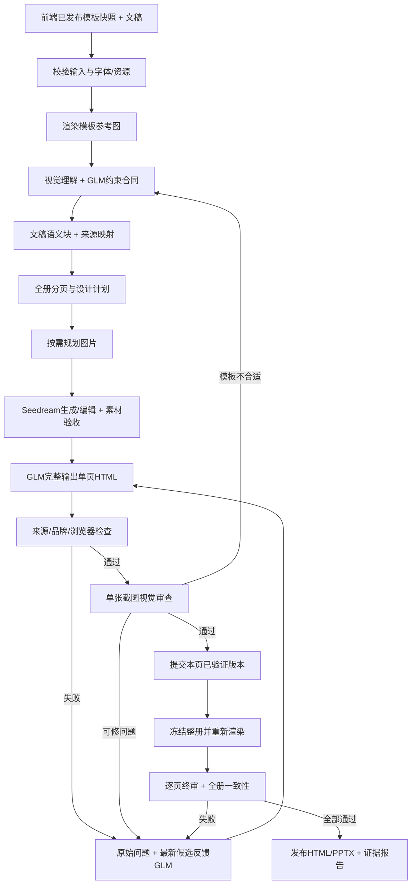

# 最可行的方案与实施说明

> 2026-09-30更新：企业v5核心已接入，实际实现与限制以[本轮v5实施与验收](v5实施与验收.md)为准。本文保留初版分析脉络，拟议能力不能视作已验收。

## 1. 要交付的究竟是什么

输入为完整文稿、前端发布的企业模板快照及必要的真实品牌素材，输出为可浏览的网页 PPT、可选 PPTX、逐页截图、可追踪的来源和质量报告。正常运行不依赖 Codex 临时修改 HTML，也不要求人工每页指导布局。

建议继续使用同事原有的网页 PPT Agent，只在选择企业模板时加载企业技能和对应工具。不要把普通生成流程重写成企业模板流程，也不要给同事另一套与原 Agent 不兼容的固定填框器。

“90%沿用模板”应转成可执行的边界，而非假装能用单个相似度分数证明：

- 封面、目录、章节、尾页沿用构图、品牌图片、主要文字外框；模型填内容并调整框内排版。
- 正文保留页眉、页脚、标题区域、品牌和主题，中央按文稿内容设计。
- 样本中的圆环、箭头、照片、表格数据不是自动锁死的品牌元素。
- 不改人工确认的品牌保护区域；自动标签只提供证据，模型仍要理解模板。
- 序言仅用于文稿明确“序言”标题下的内容，位于封面和目录之间；没有序言模板则使用正文，不自行创造序言。

## 2. 当前代码已经具备什么

| 能力 | 当前实现 | 结论 |
|---|---|---|
| 前端拆分、打标、发布 | 前端模块；后端保存 JSON 发布快照 | 前端由你迁移，后端不重复解析 PPTX |
| 模型理解模板 | `analyze_contract`、`analyze_reference` | 有真实工具调用与缓存 |
| 完整 HTML 生成 | `enterprise_full_html`，GLM 返回整页文档 | 企业真实生成走模型完整输出；旧试填/演示代码不是这条链路 |
| 来源、数字、表格检查 | `document_check`、`validate_sources`、`chart_spec` | 保留原文，绑定图表来源 |
| 浏览器检查 | `enterprise.mjs` | 字号、文字碰撞、画布、固定几何、品牌样式等 |
| 单页截图审查 | `presentation_vision.py` | 每请求一张成品图；初审可并发3个独立请求 |
| 单页修复后再看图 | 企业修复循环 | 每次仍一张；具体错误反馈项目模型 |
| 换正文模板 | `select_body_repair_template` | 可重新分析正文合同，不改固定页用途 |
| 优化已有成品 | `/optimize`、`/resume-optimization` | 保留原版，同一项目内产生新版本 |
| 原稿与草稿预览 | 独立 preview 服务 | 无需等整册完成 |
| Seedream 生成/参考图编辑 | `presentation_images.generate_image` | 工具已有；**企业模式未连接素材规划与调用** |
| 所有问题自动稳定消除 | 尚无此结论 | 真实截图仍存在漏检、约束过窄及折行 |
| 严格最终发布门禁 | 未完整实现 | `completed` 表示导出结束，不能当成审美验收通过 |

当前配置中，文本请求使用项目 GLM-5.3，截图复核使用 `doubao-seed-2-1-pro-260915`。模型ID必须作为配置，不应该成为同事的代码硬编码。Seedream具体版本也由部署账号的可用模型决定。

## 3. 模型和工具如何分工

| 部件 | 应负责 | 不应负责 |
|---|---|---|
| GLM 主 Agent | 理解内容、分页、选模板、选择视觉表达、提出图片任务、读反馈决定修复动作 | 凭文字声称截图已经好看；自行发明原稿数字 |
| GLM 页面生成 | 完整 HTML/CSS、正文图表容器、语义换行与层次 | 通过缩字、隐藏、移出画布骗过检查 |
| Seedream | 相关场景、概念产品素材、参考图编辑，形成真实可用图片 | 生成整张含文案的 PPT 截图替代 HTML；创造正式logo或统计图数据 |
| 视觉模型 | 看实际 PNG，指出看得见的问题和修复方向，复查已改问题 | 输出CSS并绕过HTML模型；把模板样本当成成品 |
| 浏览器/验证工具 | 字体、几何、资源、来源、品牌等客观检查；记录版本 | 通过固定规则替模型生成正文布局；擅自修改HTML |
| 编排器 | 有限重试、任务队列、缓存、版本回退、预算、验收状态 | 静默吞异常后当作无问题；用成功导出替代质量结论 |

可以是一个主 Agent 调用多个职责不同的模型请求，不需要引入相互聊天的多 Agent 系统。当前 `PresentationAgent.call` 是宿主受控工具编排，不等于底层供应商自动执行 function calling。迁移时保留这个边界即可。

## 4. 推荐的完整生成链路

### 4.1 输入预检和模板理解

检查16:9、字体可用性、所有素材可加载、页用途、元素顺序和发布版本。用实际模板渲染结果生成参考截图，而不是让模型凭打标猜测样式。

模板视觉理解与成品视觉审查分开：前者可以看模板；后者每次只看一张成品截图，并附文字化约束。之前把两张图放在一起时，确实出现过模型将模板占位字当成成品错误。

GLM输出 `protected_elements`、`text_frames`、`title_element`、`body_frame` 与依据。人工品牌标记不得移除；正文白色底板应保留，但**保留底板不意味着旧示例文字的起点就是正文边界**。本项目多页x=330造成左边大片空白，根源在合同而非CSS微调。

### 4.2 文稿与全册设计计划

先为标题、段落、列表、表格建立稳定 `block_id`。保留原始文本、来源行号、数字与引用。页面计划需说明：页用途、绑定的模板页、来源块、这一页的视觉重点、正文关系类型、图片是否必要。

不只选择“模板第几页”。同一种正文模板，可以按不同内容生成对比、时间轴、分层路径、表格、场景图、数据重点等不同结构。模板决定品牌语言，内容决定中央信息组织。

正文多并不意味着强塞一页。初始设计允许模型续页；已经发布的版本优化若锁定页数，仍放不下，应明确提出分页变更，重建页码和来源映射后复核。不能在一次修复里偷偷改页数导致后续反馈错位。当前优化路径锁定组内页数，这会限制极密页面的上限，迁移时需要保留明确的重规划入口。

建议先完成一批有代表性的正文页，做真实检查，再继续整册。无需等56页全部出完才发现正文合同有问题。若共用合同更改，引用该合同的后续页面必须重验；已经通过的页面不能无条件套用新合同。

### 4.3 Seedream 在企业流程中的正确位置

**图片先生成并验收，再让GLM根据实际图片设计HTML。** 不先生成一个不存在图片的页面，最后硬塞图片。

企业分支新增 `plan_enterprise_assets`：输入文稿、正文页面计划、主题、可用真实产品图；GLM返回 `asset_id`、使用页面、画幅、主体与留白要求、完整提示词、是否引用已生成锚图，以及不用图的理由。宿主校验只允许已规划的正文用途，执行已有 `generate_image` 工具。

生成素材落地后建立受控素材清单：模型、请求摘要、提示词、来源、尺寸、文件hash、适用页、参考素材关系。HTML只引用清单内别名，由宿主展开为已验证的本地资源；不能放开任意外链或让模型自行粘贴不明图片。

同一产品多场景优先参考同一锚图，避免包装外观漂移。没有真实产品图时，只能作为概念图，不能当成真实包装、产品功能或品牌认证。企业封面/尾页原有品牌画面不因为接入Seedream就被自动替换。

纯数据、表格、来源清单不应为“有图”而加无关照片；对这些页面，好的信息排版比装饰图片重要。统计图仍由真实表格数据和图表工具生成，不交给生图模型画数值。

火山官方图片生成接口支持文本/图片输入及 `b64_json` 输出，现有工具已使用这类接口。需要补的是企业链路中的规划、素材别名和验收连接，而不是另找一个Codex生图方式。[官方接口](https://docs.volcengine.com/docs/ark/image-generation-api?lang=zh)

### 4.4 模型完整生成 HTML

输入包含原始来源块、页面目标、模板约束、主题、实际素材清单、相邻页面设计摘要。输出必须为完整HTML和必要的来源绑定图表声明。

宿主只展开资源、渲染和校验，不拼装正文布局。固定品牌节点可使用无损别名；正文容器、图片裁切、表格和文字布局由GLM输出。精确的元信息缺失时使用AiPPT，不臆造汇报人和日期。

不需要给主模型几百条针对某一模板元素号的判断。必须保留的是通用的不可变约束、结构化来源协议和真实错误反馈。

还有一个值得优先简化的接口：当前把大段HTML再次嵌入模型生成的JSON字符串，容易发生引号转义和括号错误。若目标GLM端点支持经过实测的结构化输出，应启用并验证；否则建议将“页面设计/图表声明JSON”与“完整HTML文档内容”分两次工具结果处理。HTML响应直接保存为候选文档并做严格解析，避免模型手工生成第二层JSON转义。这里说的是模型输出通道分离，不是让宿主替模型编写HTML。

## 5. 如何让“自我调试”有效

修复请求必须同时携带：原始任务问题、当前未解决问题、最新候选HTML、精确浏览器反馈、真实视觉反馈、模板合同版本，以及此前失败历史。不能只说“请美化一下”。

推荐动作只有这些有明确用途的操作：

1. 在当前合同内改写整页布局。
2. 当前正文合同误锁中央内容时，重新分析合同。
3. 当前正文模板不适配文稿时，改选同企业模板中的正文变体。
4. 图片错误时修复图片任务或替换素材，再重新排版。
5. 内容确实放不下时，进入显式续页/重规划步骤。

每阶段一次初始尝试加最多3次自我修正。无效JSON、来源错误共用这3次，不能互相嵌套无限重试。浏览器和视觉问题还要受页级总次数、整任务总次数和费用上限约束。预算/鉴权/模型不可用属于操作性错误，不是让模型反复改HTML能解决的问题。

本轮已修正一个具体代码缺口：JSON纠错覆盖了原始 `validation_feedback`，导致模型在修好JSON时又恢复旧字号和旧标题宽度。现在保留 `original_task_feedback`，该回归已有测试；正在执行的旧worker需下一次加载才使用这段新Python代码。

推荐建立问题台账：`issue_id → first_seen_revision → attempts → last_action → resolved_in_revision`。下一次视觉请求明确检查原问题是否解决，同时检查有无新问题；“报告没再提到”不自动等于修好。

候选版本先写到独立目录；浏览器和视觉都通过后，才原子更新已验证版本指针。当前实现会先保存候选plan供检查，失败再回滚，因此预览必须标注候选状态。生产接入应改为两条指针：`candidate_revision` 与 `accepted_revision`，避免用户把待检页误当成最终页。

## 6. 最终验收不能只有一个 pass

建议把执行状态与质量状态分离：

| 执行状态 | 质量状态 | 用户含义 |
|---|---|---|
| running | reviewing | 生成/修复中，可看草稿 |
| completed | needs_review | 文件已导出，但质量仍未通过 |
| completed | incomplete | 有页面未审、工具失败或证据不完整 |
| completed | accepted | 同一冻结版本全部必需检查通过，可作为验收成品 |

`accepted`需要满足以下全部条件：

- 来源完整，数字、表格和图表绑定通过，没有隐藏正文或原始Markdown泄漏。
- 固定品牌与文字外框通过；人工品牌没有被重分类后绕过。
- 每页浏览器检查通过，且没有缺图、遮挡、溢出、不可见序号。
- 每页都有匹配当前HTML/素材/字体版本的截图审查记录，不能使用修复前截图的旧结论。
- 具体可读性问题清零：包括数字区间被拆断、短标签孤字换行、必要信息不见、严重偏置和重复卡片拥挤。它们不能简单归为low偏好后放过。
- 冻结版本重新渲染，由独立审查上下文逐页终审；不告诉审查模型“这些页已经通过”，避免暗示它沿用旧结论。
- 全册主题、标题体系、页码与目录一致；正文布局有合理变化，不能只凭一张图推断整册节奏。

独立终审可以使用同一个视觉模型的不同请求上下文，并不意味着模型能力独立，也不保证不会共犯同一错误。因此上线前还需要固定评测集及人的抽验。Codex在本次研发中承担这项外部验证；它不应成为生产链路的隐式依赖。

不建议用未经校准的“美观95分”充当事实。先用明确缺陷和来源/品牌门禁决定是否通过，再用层次、构图、图文关系、节奏等评价记录比较候选版本。

## 7. 真实运行说明为什么需要这些改动

PROJECT / 99162889 的原稿56页。新版本已出现明显改善：第5页内容不再挤到右侧，第6页形成左右信息层级，第7页突出关键数值。但目前还不能称作高质量成品：

- 第3页仍左侧空出约330px，模型通过不代表布局合理。
- 第6页修大字号后出现价格说明末尾单字“带”换行。
- 第8页视觉模型实际看到了W1–3、W3–6、W5–8断成两行，却将它归为low，现有逻辑据此通过。改进重点是质量判据和问题闭环，不是再次无差别调用更多视觉请求。

这些截图及记录见[实测证据](resources/evidence/README.md)。用真实失败样例建立回归，比仅增加提示词长度更可靠。

## 8. 建议实施顺序

**P0：先保证输出结论可信。** 补齐原始反馈保留、候选事务、问题台账、明确的质量状态、精确版本绑定和最终门禁。固定测试至少包括：漏页、旧截图通过、新增折行、模板品牌越界、JSON修复丢失原问题、预算中断、正文模板切换后的断点恢复。

同时减少HTML外层JSON包装造成的格式故障。内容策略仍保持当前“原稿完整可见”；若未来需要摘要式提案，必须作为另一个明确模式，并保留原稿附件与事实映射，不能在美化循环中偷偷删减原稿。

**P1：打通企业素材链。** 复用当前Seedream工具，增加企业图片规划、生成/编辑、素材清单、受控别名、图片内容审查；仅在正文需要时调用。先验证一个真实产品/场景页面及一个不应配图的数据页面。

**P2：将质量检查前移。** 模板理解后先做代表页，合格后再批量生成。修复时先判断合同与模板适配，不把所有问题都交给单页CSS调整。补上明确的续页重规划。

**P3：固定评测再接入生产。** 覆盖封面元信息、目录序号、章节编号、可选序言、长段落、宽表、多种图表、来源清单、需要图片的正文和纯文字正文。要求全部硬检查通过，视觉与外部抽验不出现阻塞缺陷，再用新增文稿复测泛化。

普通网页PPT分支保留原行为，企业扩展以 `template_id + template_revision` 触发。不要为了企业能力悄悄改变普通模式的分页、主题或素材规则。

## 9. 与118的关系及结论边界

可借鉴的是来源已经记录的设计原则和工具顺序：参考理解、内容规划、先素材后页面、真实渲染、看图、修复。当前完整HTML企业模板适配、前端JSON合同、来源检查、浏览器约束和断点恢复是本项目实现。

已有研究记录表明，118可见工具并未提供已确认的企业PPTX母版保真转换器；也不能由某个图片工具使用Seedream推断118所有生图都用同一供应商。不要向同事宣称本项目复制了118完整私有实现。依据见[此前企业模板评估](resources/research/enterprise-template-reuse-assessment-2026-09-28.md)。

最值得交接的是**可执行的职责分工、数据合同、错误闭环及真实验收证据**，而不是一份声称“加载后就自动变高级”的长提示词。
