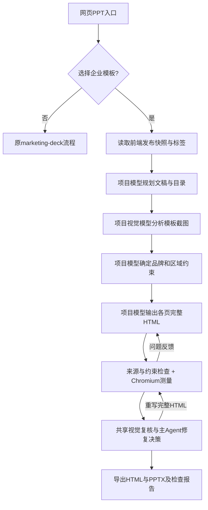

# 2026-09-29：企业模板改为项目模型完整 HTML 输出

当前正式企业模板任务使用 `3.0.0-enterprise-html-v4`（完整HTML生成＋可选序言）。下方 v1/v2/v3 记录保留为历史；原先“固定页程序替换＋正文几何 JSON 编译”仅保留在离线 demo 与标签试填中，正式模型生成不再调用。

## 2026-09-29：可选序言页

- 前端新增 `preface / 序言页` 页面用途。规则打标支持“序言”与拆开的“序 / 言”标题，保留人工用途；不会按“第二页”位置将所有模板强制分类为序言。
- 文稿须有明确的“序言”标题且标题下有内容才触发；范围持续到下一个同级或更高级标题，包含下级标题。正文提到序言、普通开场、项目背景、摘要、引言均不自动触发。只有标题但没有内容时也不生成空序言页。
- 存在序言模板时：封面 → 序言（可续页）→ 目录 → 正文章节 → 尾页。序言不计入专用目录或章节编号；没有目录模板则序言后直接正文。长序言按来源分批规划，目录只在全部序言之后生成。
- 没有明确序言内容时，模型可选模板目录不包含序言版式；有序言内容但缺少序言模板时，相关标题和内容按普通正文处理。检查器拒绝将一般正文塞进序言页，或把序言放在目录/正文之后。
- 程序仅识别明确标题的来源范围及检查模型规划；序言页仍由项目模型生成完整HTML，沿用原模板约束、来源覆盖、浏览器与视觉检查。普通网页PPT流程与版本 `3.0.0` 不变。
- 已通过真实浏览器前端将当前28页企业模板（`28201bba…`）第二页设为序言并发布v2。仅第二页用途从body变为preface，v1历史快照保留；已有任务不会被改写，后续选择v2生成生效。
- 改动位置：`marketing/frontend/enterprise/{types.ts,labels.ts,Manager.vue}`；`marketing/marketing_agent/enterprise/{uploaded_templates.py,manuscript.py,template_html.py,model_html.py,service.py}`；企业Skill及HTML协议；企业任务版本。前端3项分类测试、后端全量134通过/1跳过，覆盖触发、跳过、正文回退、标题范围、跨批顺序、新版本与旧快照隔离、标签试填。
- 项目 `PresentationAgent` 实际模型规划测试三组均通过：有序言→cover/preface/contents；无序言→cover/contents；缺少序言版式→相关来源全部进入body，不出现preface。此次只验证模型分页规划，没有重新生成整套PPT或调用付费生图/视觉工具。模型原始回复和工具轨迹位于 `.local/enterprise-preface/routing-checks/`，前端发布截图位于 `.local/enterprise-preface/manager.png`。部署后首页/API健康检查均200。

### 项目99162889分页错误排查

- 失败任务 `ed22ef2da8c04f128e78d7837a333558`，模板v2。原稿113个来源块、6个规划批次，没有明确序言来源；尚未进入HTML/生图/视觉阶段。
- 第一批模型将 `b0002`（客户、日期、预算、周期等混合段落）放cover，将 `b0004`（原稿目录列表）放contents；与现有“辅助页只承载heading来源”合同冲突。校验只反馈笼统错误，连续重试仍保留同样分配；相同请求还会命中相同旧响应缓存。
- 修改 `enterprise/model_html.py`：每个输入来源附allowed_page_roles；错误包含具体页、来源ID、类型、片段与允许用途；重试带上一版规划及attempt，避免重复复用相同错误请求。由项目模型重新分配，宿主不移动原文、不手工生成HTML、不跳过来源校验。
- 封面仍可展示提取的元信息，原稿整段项目信息及原目录清单须完整保留在正文；独立生成的目录使用agenda_ids。分页错误逐次写入 `planning-corrections.jsonl`。
- 新增实稿结构的回归测试，验证模型收到明确约束和反馈后可重新规划；相关20项测试通过，修复已部署到18080。原失败任务和错误日志保留，不伪造为成功。
- 实际项目模型复测完成：原稿113块、6个批次全部通过分页校验，规划56页，无序言页。11次调用（含摘要缓存及重试）；第一批目录列表误放、第三批章节序号、第四批口径声明误放章节页、末批漏尾页均由模型在反馈后修正。证据在 `.local/project-99162889-planning-fix/`。本次只重测分页，没有生成这56页HTML/PPTX，也没有额外调用生图或视觉模型。

### 模板区域冲突与三轮自我纠错

- 后续任务 `fbf85bbc2d3940c792e3526727a41269` 已越过分页，失败于模板27页合同分析。元素13是中央示例“填加文字”，自动标签title；真实页眉标题为元素2，自动标签brand。模型混淆标签语义，先错选13为主标题，随后虽改为2，仍把13留在text_frames，与body_frame重叠。错误不来自用户文稿，也不是图片额度。
- `text_frames` 表示文字可替换但外框位置/尺寸固定。反馈现包含模板页、元素、实际文字、标签来源和双方矩形，并明确中央示例通常须同时移出两个固定列表；previous_contract保留上一版，repair_attempt改变每轮请求，避免相同错误缓存循环。宿主只校验，不擅自删除列表项或修改模板。
- 按用户要求统一 `MAX_SELF_REPAIRS=3`：首次尝试失败后最多3轮模型纠错，共4次。企业摘要/元信息、分页、模板合同、主题、完整HTML统一使用repair_model；格式错误与内容错误共享轮数，不叠加成多层重试。浏览器修复及截图布局修复各最多3轮。任务调用预算耗尽属于不可通过模型修复的条件，保留预算保护。
- 日志记录tool、attempt、self_repairs_used、will_retry、reason；模板合同逐版保存，已通过的页面/合同及草稿保留。3轮后仍不通过才抛出带最后原因的异常；视觉预算不足或布局仍待处理保持真实状态，不冒充完成。
- 全量139通过、1跳过，包含JSON错误与内容错误共用3轮、第三轮成功、第4次失败准确终止、调用预算不被重试绕过、合同坐标反馈及原模板不变。修复已部署18080，普通网页PPT流程未修改。
- 本次选中的16个模板版式已全部通过项目模型实际合同分析（18次文字模型调用、2次自我修正）。原失败的模板27页正确只保留顶部元素2为text_frames；模板16页漏保护元素和模板26页中央示例误锁均在一轮反馈后由模型修复。原回答、合同、错误与工具轨迹位于 `.local/enterprise-contract-repair/`。这证明本阶段已验证，不代表整套PPT已重新生成或视觉验收。
- 未显式配置企业总调用次数时，在完成分页后按实际页数、选中模板数及每阶段最多3轮纠错计算调用空间，最低80、最高400；显式配置的上限仍优先。原固定80次可能连长文稿的首次生成都无法覆盖，现避免因此提前耗尽纠错空间。图片/视觉金额预算与累计次数未变，此处仅为项目文字模型的任务保护次数。

## 入口与 Skill

前端 PPTX 拆解、规则打标、人工编辑、发布保持在浏览器。普通网页 PPT 未选择企业模板时沿用现有流程；选择已发布模板后，由同一个 `PresentationAgent` 加载 `marketing/presentation/skills/enterprise-deck/SKILL.md` 及其 `references/html-contract.md`。

自动标签、字段名、配对顺序都是模型理解模板的参考，不通过“最近距离”“最大字号”等条件机械配对。人工标记的品牌元素必须保护。固定页优先沿用原构图，正文中心允许自由设计，所有页型由模型输出完整 HTML。

## 模型与宿主的职责

- 模型：理解打标、确定目录/序号对应关系、提取汇报人/导师/时间、规划分页、分析保护范围、生成完整页面 HTML/CSS、按检查结果修复。元信息缺失逐项使用 `AiPPT`。
- 宿主：读取不可变快照、解析来源、展开图片/原品牌节点的无损资源别名、验证来源与图表数据、验证已确认保护范围、检查实际尺寸/碰撞/可见性、导出及记录日志。宿主不拼装正文、不重排目录、不自动设置两行元信息。
- `__PPT_PROTECTED_N__` 是原品牌节点资源引用，与 base64 图片别名同类；模型在完整 HTML 中保留引用，宿主只无损展开。不是回到固定字段填充。
- 已确认的品牌节点由 DOM 与浏览器实际计算样式双重检查，避免模型通过新 CSS 或父级布局间接改变；正文边界、隐藏文字、字体与来源内容单独检查。
- 普通页设计原则、项目主 Agent、参考图分析、累计预算、截图审查、修复决策与来源绑定原生图表工具复用现有实现。企业 HTML 适配层处理模板约束与原画布导出；不是另起 Codex 生成链路。
- 所有页型可进入截图修复；续页组整体修复并核对完整来源。修复失败回滚，明确保留问题；不退回旧规则排版，也不把未完成的视觉检查算作通过。

## 改动位置

| 文件 | 改动 |
|---|---|
| `marketing/marketing_agent/enterprise/model_html.py` | 完整HTML生成适配、模型模板合同、内容检查、全页型修复 |
| `marketing/marketing_agent/enterprise/workflow.py` | 正式任务进入完整HTML；旧流程隔离为demo |
| `marketing/presentation/skills/enterprise-deck/` | 选择企业模板时加载的项目Skill及HTML协议 |
| `marketing/marketing_agent/presentation_agent.py` | 现有参考分析工具接受企业模板截图和分析要求 |
| `marketing/presentation/enterprise.mjs` | 实际计算样式/保护范围/正文边界检查，不修改排版 |
| `marketing/marketing_agent/presentation.py` | 企业任务版本升级，旧结果不混用 |
| `marketing/frontend/enterprise/Manager.vue` | 明确标签为模型参考，标签试填不代表最终效果 |
| `marketing/tests/test_enterprise_model_html.py` | 完整输出路由、资源别名、约束、元信息、全流程封面修复回归 |

## 边界

“90%模板样式”是视觉沿用目标，未虚构一个机器测量的90%相似度。新分支沿用企业模板素材，不主动发起新的付费生图。复杂装饰栅格化、普通文本可编辑、来源绑定统计图原生导出；表格尚不是PowerPoint原生表格对象。视觉模型预算不足或关闭时明确记录未完成，不冒充视觉验收。

---

# 企业模板 PPT：16:9 工作流与实现记录

更新：2026-09-29，正文自适应排版 v2。

## 使用入口

18080 工作台左侧“企业模板管理”。浏览器解析 PPTX、拆页、提取资源、规则打标和人工编辑；保存结构化 JSON，后端不接收 PPTX 解析、不写回标签。仅支持16:9，最大30MB、40个模板版式。

导入 → 核对页型、标题及企业固定元素 → 预览与试填 → 发布 → 新建项目或已有项目的PPT面板选择企业模板。发布版本不可变，每次任务保留独立快照。

## 排版边界

| 页面/区域 | 生成规则 |
|---|---|
| 首页、目录、章节、尾页 | 保留版式和原文字样式，替换内容；目录可按原版式续页 |
| 正文顶部标题、页眉、页脚及企业品牌 | 保留标题区域的位置、样式与企业固定元素 |
| 正文中央 | 模板只作参考；原小文字框、中央样例图表和装饰不再是填充约束，模型按原稿重新分组、分栏及排版 |
| 主题色、字体 | 从上传模板提取，不使用另选的通用主题覆盖 |
| 表格、统计图 | 原稿提供数据；重新生成实际表格和图表，借鉴模板配色，不照抄示例数值 |

正文标签只作为参考。后台从已解析的元素和几何信息建立本次任务的设计合同，不修改前端标签或发布快照。顶部标题优先采纳人工标题，再依据顶部文字位置识别，避免把正文中的大序号当成页面标题。复杂模板仍需核对设计合同与实际截图，不承诺自动识别永远正确。

## 项目 Agent 工作流

1. 将文稿解析为稳定来源块，模型按语义规划页型与内容，全文保留，最多200页。
2. 为正文建立固定区域与安全内容区，提取企业主题、参考元素及字体，写入 `enterprise-design-contract.json`。
3. 按内容区容量预分组；正文模型输出布局JSON，决定每个来源块的位置、大小、字号、对齐、强调和主题色角色。复用普通PPT的 `marketing-deck/references/page-generation.md` 视觉排版原则。
4. 宿主按来源引用注入逐字文稿，编译HTML。模型不直接重写文字或拼接数值，不提供任意活动HTML。
5. 表格保留所有单元格，长表可按行续页并重复表头。统计图可选横条、柱、折线、环形：模型指定来源列，程序复用 `presentation_charts.validate_chart` 从原文单元格读取数据，拒绝范围、约数和无依据的单位换算。原始表格继续保留。
6. Chromium检查真实文字、边界、字号、碰撞和资源。正文问题反馈给模型重排内容区；必要时保留全文续页。固定页保持锁定，无法容纳时记录具体问题。
7. 项目视觉模型同时查看生成截图与对应原模板截图，检查品牌一致性、层级、密度、留白、表格/图表可读性与跨页节奏。与通用PPT一样不能仅凭无溢出就判断设计合格。
8. 最多两轮截图修复、每轮三页；修复后重新校验全册来源和固定区域、重新渲染与复核修改页，不通过回滚。预算不足、未审完或仍有问题分别记录，不冒充通过。
9. 导出HTML、PPTX、截图、来源备注、工作流与调整日志、视觉报告。普通文字可编辑，统计图使用PptxGenJS原生图表并嵌入源数据。

正常执行全部由项目服务及其模型完成，不需要Codex逐页生图或调整结果。演示模式和模型失败时使用保留全文的基础排版，报告明确标识 `demo` / `fallback`；这不是模型设计成功。正文模型调用默认最多80次/任务，可通过 `MARKETING_ENTERPRISE_LAYOUT_MAX_CALLS` 设置。图片/视觉沿用原累计预算，未清零。

## 改动位置

| 文件 | 内容 |
|---|---|
| `marketing/frontend/enterprise/` | 前端解析、标签、编辑、预览、发布；正文标签与试填提示更新 |
| `marketing/marketing_agent/enterprise/adaptive.py` | 企业固定区域、主题提取、正文布局模型合同、来源填充、表格与图表绑定 |
| `marketing/marketing_agent/enterprise/workflow.py` | 规划、逐页设计、探针修复/续页、模板对照截图、视觉修复与回滚 |
| `marketing/marketing_agent/enterprise/service.py` | 模板版本、发布/检查、正文安全内容区试填 |
| `marketing/marketing_agent/enterprise/template_component_render.py` | 固定页替换；目录分段不再跨同页倒序的元素填充；原模板可容纳的短标题不因估算被截断 |
| `marketing/marketing_agent/presentation_vision.py` | 企业原模板对照与正文完整设计审查规则 |
| `marketing/presentation/enterprise.mjs` | 浏览器测量、截图、HTML、文字和原生图表导出 |
| `marketing/presentation/charts.mjs` | 图表接受企业主题配色，通用PPT默认配色不变 |
| `marketing/presentation/skills/enterprise-deck/SKILL.md` | 项目企业模板 Agent v2执行规则 |

企业生成任务版本为 `3.0.0-enterprise-v2`，旧完成任务不会被误当成新流程结果复用。原通用PPT流水线版本不变。

## 复用来源

相邻 `agent-api-master-455fb50c17064d6d222c8af21e2c7a03063bfd8a` 项目的前端解析/规则标签/编辑器，以及后端固定页渲染、版本、字段和来源校验。正文自适应设计合同为本项目新增；图表绑定和视觉排版原则复用当前项目既有实现，不声称这些文件是118原始skill。

## 当前边界

- 新流程允许正文自由布局，暂不自动付费生图；中央无关的模板示例图片不要求保留。
- 原始模板的嵌入对象、复杂图表、纹理与效果仍有导入还原限制；普通文字可编辑，复杂装饰和变换文字栅格化。重建表格当前为可编辑文字与栅格化线条，不是原生PowerPoint表格对象。
- 字体缺失仍会发生替换，前端与服务端分别提示；没有完成PowerPoint应用内渲染一致性验收。
- 不可把功能测试通过等同于真实企业模板设计质量达标；需要实际模板与项目视觉复核。
- 当前为本地工作台存储，没有新增企业多租户权限系统。

## 验证记录

- Python全量测试107通过、1跳过；随后新增的正文底板保留回归测试也已通过。新增6项v2回归测试，覆盖固定区域/快照保护、正文几何自由、原文与表格完整性、图表数值绑定及目录倒序元素兼容。
- 通用渲染器测试：容器内11项全部通过。宿主机缺少Playwright浏览器缓存，已使用项目Docker内的Chromium验证。
- 隔离真实浏览器：PPTX上传、前端解析/打标、发布、选择模板、生成与下载全链路通过，无付费模型调用。
- 独立企业正文图表样例：真实Chromium排版检查与PPTX导出通过，读取PPTX内部图表XML确认原稿数值30、20及原生图表对象。

- 使用实际上传的28页企业模板及原项目的两段原稿，通过项目 `PresentationJobs.execute` / `PresentationAgent` 跑通真实模型端到端短稿验证，生成7页，正文2页均记录为 `model_designed`，浏览器检查通过。Codex仅启动项目流程、查看日志和结果，没有手工改生成页面。该测试关闭视觉付费调用，不代表全册视觉验收或完整99162889项目重生成完成。
- 测试任务：`1beffa89f08a490a908233833fb1b7a1`，输出位于本地忽略目录 `.local/enterprise-v2-render/project-agent-e2e/presentations/`，未写入正式项目列表。

- 新流程已部署到本地18080，API健康检查通过，现有数据保留。正文背景中的空白大文字形状也作为底板保留，避免移除中央样例后露出底层整页图片。当前打开的7页测试文件保持原项目Agent生成结果，没有手工重排。

## v3 验证与修正进展

- 已验证普通网页PPT入口与企业入口隔离：未选择模板仍从原 `plan_outline` 进入，原流水线版本 `3.0.0` 不变。普通参考图分析的默认提示词和缓存键保持原样；配图模型、配置与预算参数未改。
- 正式企业路径不再调用字段填充或几何JSON编译器；回归覆盖全HTML输出、源快照不变、资源别名无损展开、自动标签作为参考、手工品牌保护、首页元信息、整组来源校验及主Agent选择封面修复。
- 真实试跑修正了过强的CSS源字符串比较（改查实际计算外框），允许省略未使用目录文字框，拒绝把同一正文区域同时定义为自由与固定，允许模型将标题来源直接分配到首页/章节页，不再由宿主搬运标题。
- 浏览器专项验证了品牌CSS间接覆盖、隐藏来源、正文越界的检测；普通渲染器11项回归通过。
- 测试始终通过项目 `PresentationJobs.execute` / `PresentationAgent` 调用配置的模型；没有手工编辑模型生成HTML。隔离测试与生产共用图片/视觉预算账本及锁，不清零次数。
- 当前累计视觉请求达到64次上限（账本为预留金额，并非最终账单），本轮不能宣称完成全册视觉验收。保持现有限制，报告会明确标记 `incomplete`。
- 企业Skill只复用普通Skill的“视觉判断”段，不加载普通模式的1280×720固定画布、body/css输出、data-ref宿主注入或统一页脚协议，避免两种模式互相干扰；普通Skill文件保持原样。
- 企业浏览器校验增加绘制遮挡检查，防止目录/章节数字虽然存在于DOM却被原模板图形盖住。字体下限按实际文字检查，避免把容器默认字号误判为文字字号。
- 企业模型格式错误由模型重试修正；HTML内容不由宿主正则“修好”。所有模型调用仍受任务调用上限约束。

### v3 本轮完成记录（2026-09-29）

后续配置调整：按用户要求，将视觉累计请求上限从64提高到1000；同步更新普通视觉审查、企业HTML修复及旧企业路径的次数硬上限。历史64次视觉请求和11次生图记录原样保留，图片/视觉合计20元的本地预算上限不变。1000为次数上限，不保证在现有金额预算内可实际调用1000次。相关27项测试通过，含超过64次、保留已有账本及1000次边界校验，无真实付费测试请求。

- 真实项目Agent短稿任务 `fd1ea748420e4efcbc842bd333bb61d2` 已完成，使用实际28页航空企业模板、轻芽原稿的两个章节，生成7页完整HTML及7页PPTX。本轮记录41次模型调用（含缓存读取、格式重试和修复），15项调整日志；不等同于41次实际付费请求。
- 最终7页浏览器探针均无问题，原文覆盖通过；目录条目、章节数字、封面/尾页元信息由项目模型生成。未手工编辑输出HTML。原始回答、模板约束、截图、工具轨迹和修复记录位于 `.local/enterprise-v2-render/project-agent-html-v3/presentations/fd1ea748420e4efcbc842bd333bb61d2/`。
- 完成状态不代表设计质量验收：正文仍有留白和装饰搭配可优化；视觉预算已用尽，结果为 `visual_status=incomplete`，PowerPoint应用内渲染仍为 `pending`。未提高预算或重置累计次数。
- 隔离任务多次恢复执行曾残留上一轮JSON错误信息，企业入口现已清空历史错误；对应回归通过。保留原测试记录，不通过重新付费生成来刷新状态。
- Python全量125通过、1跳过；最后一次企业回归12通过；普通渲染器11项通过，企业Chromium保护范围、隐藏/遮挡、越界专项通过。前端和API镜像构建成功。
- 已部署到本地18080，部署前确认9个项目无运行中任务，保留全部数据。部署后 `/api/health` 与 `/` 均200，运行时为 `deerflow`；已打开本轮HTML结果。普通网页PPT入口、Skill、默认参考分析提示词/缓存键及流水线版本 `3.0.0` 保持原样。

### 生成中页面预览（2026-09-29）

- 前端新增 `marketing/frontend/enterprise/PresentationDraft.vue`，在企业任务完成前显示“预览已设计页面”。每3秒读取已保存的完整页面，支持上一页、下一页和按标题选页；明确标注草稿尚未完成整套排版与视觉复核。页数以完整HTML为准，不能直接使用“正在设计第N页”的进度数字。
- `marketing/marketing_agent/presentation_preview.py` 提供独立只读服务和 `/api/presentation-drafts/{job_id}`、`/previews/{number}` 接口。挂载数据卷为只读，使用现有企业Chromium渲染器在临时目录按需截图，按页面内容缓存；不启动生成任务、不修改HTML/原任务状态/校验报告、不调用任何付费模型。缓存最多200张，截图串行生成。
- `compose.marketing.yaml` 新增preview服务，`marketing/frontend/nginx.conf` 单独转发草稿请求。普通网页PPT生成和最终文件下载接口保持原样。已完成任务仍使用原有最终预览入口。
- `enterprise/model_html.py` 保存plan改为临时文件原子替换，避免读到半写文件；针对正在运行的旧函数，预览服务会保留最后一个完整快照，在下一次保存完成后继续更新。
- 检查时发现企业渲染器读取模板参考报告的条件仍限定v3，会使v4错误报告固定元素几何变化；改为以页面 `model_html` 判断，并将参考读取放入浏览器关闭保护范围。新增真实Chromium回归，确认v4固定元素与参考一致时正常通过。这仅修复校验基线加载，不调整模型输出。
- 验证：Python全量144通过、1跳过；企业Chromium专项2通过；前端构建成功。真实浏览器进入项目99162889，打开第1、2、10页草稿并成功显示1200×675图片，无JS错误，无修改型API请求。截图保存于忽略目录 `.local/live-ppt-preview/`。
- 部署只新增preview并更新web，API没有重启，启动时间保持 `2026-09-29T09:34:55.857786087Z`。当前任务 `5eacb1f68f17447fbbf179bfce3effa4` 继续运行，验证时已设计23页、正在第24/52组。已测试的渲染器基线修复同步到运行容器，供其随后正常调用；未手工改写任何生成页面。预览可用不代表最终全册质量验收通过。

### 第48组固定装饰节点错误定位与纠错反馈（2026-09-29）

- 同一任务随后在第48/52组失败，47页完整草稿保留。失败页是“十、数据来源与核验清单（主要来源）”，采用模板第22页的章节版式。错误中的9为模板节点索引，不是PPT页码。
- 复核四次项目模型原始输出，均未保留 `__PPT_PROTECTED_9__`、`__PPT_PROTECTED_10__`，而是自行写出同ID的空/文字容器。元素9原节点有62个后代节点（含SVG、渐变及26个path），末轮只剩div/p/span三节点；元素10的SVG也被删除。校验正确拦截，但旧反馈只报首个元素且没有具体差异，模型反复猜测错误的“原节点”。
- 修改位置：`marketing/marketing_agent/enterprise/model_html.py::document_check`。一次汇总所有损坏/缺失/重复的固定元素，反馈结构数量、标签统计和具体恢复别名，明确要求在原父级原顺序引用一次，不套重复容器、不猜测SVG；仍由项目模型完整输出HTML，校验器不改HTML、不移除保护规则。首次生成加最多3轮模型纠错的上限保持不变。
- `marketing/tests/test_enterprise_model_html.py` 新增多元素损坏、具体别名反馈传递、修复后无损还原、缺失/重复节点的回归。Python全量147通过、1跳过。
- 使用项目 `PresentationAgent` → `enterprise_full_html` / 配置文本模型，针对末轮真实失败结果做一次隔离修复。仅1次真实文本模型调用，元素9/10及来源校验通过；浏览器仍发现标题和两位章节号溢出、两个文字框几何偏移，因此不宣称单页或全册最终验收通过。未调用额外生图/视觉模型，未修改原任务47页，也未重新启动整套生成。
- 证据存放 `.local/enterprise-protected-feedback/`（忽略目录）：新反馈、模型原始响应、项目Agent轨迹、单页HTML计划、截图和浏览器报告。后续排版问题仍交给原项目Agent浏览器/视觉反馈流程处理。
- 已部署纠错反馈到18080。部署前确认没有运行中的营销/PPT任务；首次重建遗漏环境文件，健康检查发现runtime为demo后立即按 `--env-file .env.marketing` 恢复，期间未启动生成。最终API健康、runtime=deerflow、模型已配置；视觉上限1000、图片上限100及20元金额上限保持原值。原失败任务状态不伪造为成功，47页草稿预览仍可用。

- 用户要求继续原项目后，已将 PROJECT / 99162889 的原任务 `5eacb1f68f17447fbbf179bfce3effa4` 从failed恢复为queued/running并清除展示错误，使用项目 `PresentationJobs.execute` 继续执行，未新建任务、未手工编辑生成HTML。原47页plan、失败状态及Agent/纠错记录备份于任务目录 `resume-history/20260929T102643Z/`。现有流程先复用本任务模型响应缓存并重验前序步骤，再继续失败位置；页码可能短暂从头显示，不等同于重新付费生成前47页。工作进程在API容器内后台运行，日志 `resume-worker.log`。

### 修正恢复为真正的断点续跑（2026-09-29）

- 上一次只重新执行原任务，实际重走前序生成，目录在缺失元素24的三轮纠错后又丢失多个固定装饰，任务再次失败。不能将此前启动方式称为从第48组断点续跑。
- 新增 `enterprise/model_html.py::resume_prefix`：读取已保存的plan，核对流水线、画布、主题、原稿指纹与来源块、模板版本、分页提案和模板约束；逐组重验HTML与来源覆盖；只复用连续且通过验证的完整生成组，直接从未完成组继续。输入不一致或草稿损坏时保留草稿并报告错误，不静默重生成。浏览器及视觉复核仍按原流程进行，不因恢复而跳过。
- 保留历史纠错日志，Agent轨迹记录resumed_groups/resumed_pages。补充源稿变化、非连续组、固定品牌改动拒绝复用、二次执行不调用HTML模型且页面不变的测试；Python全量148通过、1跳过。
- 将任务原47页从 `resume-history/20260929T102643Z/plan.json` 原样恢复，再次失败证据保存至 `resume-history/20260929T103142Z/`。再次启动项目PresentationJobs，实际确认resumed_groups=47、resumed_pages=47、page_progress=48/52、status=running、error=null。没有手工编辑页面HTML。

- 续跑结果确认：第48组通过生成阶段HTML/来源/品牌保护校验，已保存48页，进入第49/52组；前47页与原备份逐页完整对象比较完全一致。这里只确认续跑与生成校验，不代表尚未开始的整套浏览器/视觉验收已通过。

### 固定标题外框的精确反馈与继续修复（2026-09-29）

- 三轮浏览器修复后，56页剩余第47、51、52、53页未通过，均为模板元素2的标题框宽度从428.125px变为560px；位置和高度未变。初轮48页问题已降至4页，但尚未进入视觉验收。
- `presentation/enterprise.mjs::inspectModelContract` 的template_geometry_changed新增selector、expected_bounds、actual_bounds及修复指引，明确恢复原外框、只调整内部文字。之前仅返回元素编号，反馈不足；本次没有放宽1px几何容差或取消固定标题限制。
- `enterprise/model_html.py::browser_findings` 只提取页号和issues，用于模型反馈与最终错误摘要，避免把含图片data URI的elements整页快照拼进异常。原完整探针仍在任务目录保存。每个页面组修复后立即校验内容并原子保存plan，后续组失败不丢失此前成功的改写。
- 增加layout_check/layout_repair阶段与repair_progress；前端显示当前轮次、页码及问题组进度，纠错阶段不再沿用52/52生成进度。
- 验证：Python149通过、1跳过；真实Chromium2项通过，覆盖实际几何差异及明确原值/现值；前端构建通过。部署使用.env.marketing，确认deerflow及模型已配置。原失败证据存于任务resume-history/20260929T110213Z，原任务从56页检查点继续交给项目Agent，不手工调整页面HTML。

- 续跑验证结果：项目Agent复用全部56页/52组，只对剩余两个问题组（第47页及第51–53页）输出修订HTML。精确几何反馈后，本轮一次改写后的浏览器复查56页issues全部为空，当前进入初版导出；视觉审查尚待执行，不把浏览器通过写成审美通过。实际浏览器检查前端已显示“浏览器复查排版/正在复查56页”，无JS错误。

### 逐页截图审查与正文模板重选（2026-09-30）

- 用户要求首次截图审查和修复后复查都一页一次，并由Codex独立检查实际HTML的美观程度。已渲染 `presentation (2).html` 全部56页，查看全册总览及6张原尺寸问题页，独立结论为不通过。详细证据与截图见 [视觉审查报告](presentation-2-review/README.md)。
- `presentation_vision.py` 的兼容入口强制逐页HTTP调用，普通与企业两条流程的初审/复查均使用单页列表；对应参考图随本页保留。缓存及预算仍逐次计数，历史账本不重置。
- `enterprise/model_html.py` 初审逐页保存报告与进度，修复后的预算预检按修改页数计算。前端区分“逐页审查 / 模型修复 / 修复后逐页复查”，避免修复时显示旧审查页码。
- 企业正文修复新增模型工具 `select_body_repair_template`，可选择同一已发布模板内其他body变体或重新理解误锁的正文约束；模型仍完整输出HTML。模板变更记录支持断点恢复，来源与人工品牌保护、浏览器校验、修复失败回退保持生效。普通模式不使用此工具。
- 实际问题来自模型误把圆环、示例照片、管道树锁定为品牌，以及过窄正文区域；单页看图不足以独立解决这些问题。真实小样共5次视觉调用，新增本地预留0.50元，不等同实际账单；另用项目文本模型验证2个正文选型。来源清单被建议改选模板第26页。未重新生成整套56页或手工修改原输出HTML。
- 测试：Python155通过、1跳过，前端构建成功。已用 `.env.marketing` 部署API、preview及web，18080健康检查成功，runtime=deerflow。图片100次、视觉1000次及合计20元预算未改变。旧PPT仍为needs_review，Codex独立审查不通过；今后成品需实际重新看图，不能继承代码测试通过结论。

### 在原项目启动可见的成品优化任务（2026-09-30）

- 用户要求项目Agent继续优化，质量优先，且必须在PROJECT / 99162889内看到结果。新增企业PPT优化入口 `POST /api/presentations/{job_id}/optimize` 及前端“Agent再优化”，创建同一run下的独立版本，保留旧任务及成品。
- 新任务 `40bf3188a3bf430fa448a664ed8a4f4f` 已启动，来源 `5eacb1f68f17447fbbf179bfce3effa4`，复用56页、52组及完整113块文稿来源。保存source-plan与模板、元信息快照；不重新分页或从头生成文稿。先全册逐页视觉审查，再由项目Agent选择模板、输出HTML、检查及复查。
- 单独记录并输入Codex上一轮截图审查的33页问题，来源字段标为independent_reviewer，不伪装成视觉模型观察。修复历史传递真实浏览器/截图问题，避免因只有“未通过”而重复同一错误。优化模式每轮允许主Agent选择最多12页，最多3轮；同组续页不重复执行。
- 按用户新授权，将本地图片/视觉总预留额度配置从20改为50元，移除代码内覆盖配置的20元硬上限；历史账本不清零，视觉1000次及图片100次限制保持。预留金额不代表供应商实际扣费。
- 已部署并确认runtime=deerflow；原项目latest接口返回40BF3188，前端显示逐页进度及56页草稿预览。成品质量仍需任务结束后实际截图验收，不能提前报告通过。

- 本轮进一步纠正“单页但附参考图”的歧义：实际观察到视觉模型把参考模板的占位文本当成成品。现在截图审查请求严格只有一张成品PNG，模板参考图仅在独立参考分析阶段使用。修复后复查同样只有一张成品图。
- Mini模型在单图条件下仍把阿拉伯1与中文一判为不一致，并要求移除用户固定航空品牌图。使用项目火山API实测 `doubao-seed-2-1-pro-260915` + medium思考后，第4页正确通过，第8页指出真实遮挡/图形信息脱节，第1页仅指出真实断词，不再要求移除企业航空图。
- 已切换该优化任务至Pro；每次仍是一张图，初审最多3个独立请求并发以缩短等待。Pro每请求保守预留0.50元，配置累计预留上限调整为100元以覆盖全册和修复后复查；这是本地预留上限，不是实际扣费或充值操作。历史账本保持。官方模型及价格参考：https://docs.volcengine.com/docs/ark/model-release-announcement?lang=zh 与 https://docs.volcengine.com/docs/ark/model-pricing?lang=zh 。
- 视觉JSON/页码不合法时将具体错误及原回答反馈原模型，最多自我修正3次；不由宿主补写审查结论。纯low偏好保留报告但不构成必修项，medium/high始终要求修复；Codex独立审查仍单独进行。
- 同一任务40BF3188恢复执行，保留此前已通过的第9页修改；resume-history保存阶段报告与页面快照。恢复时按每页实际约束重验，避免失败的约束重分析污染已经保存的页面合同。

- 实际优化第8页时，项目模型已换用宽敞正文模板，但17px正文被浏览器下限检查拦截。新增修复后的本页校验循环：首次改写之后，浏览器或Pro发现问题会携带具体反馈及上版候选HTML，立即让原项目模型最多再修正3轮；通过后才提交该组，仍失败才回退。候选页面和反馈保留为visual-candidate文件，不通过宿主改字号或降低检查标准解决。
- 后续纠错沿用已选模板，避免每轮重新选型；修复要求的组内页数也进入模型内容校验反馈。优化任务主Agent每轮可选择最多40页，保证大量正文问题有机会处理；普通生成仍保持每轮3页上限。对应回归验证17px浏览器错误能传回模型，直到新HTML通过后才调用截图复查。
- 前端新增项目直达参数：`http://localhost:18080/?project=99162889686a4e7ca7f3a69a83e93c86`；显示当前视觉模型、已完成页数及最近审查页码。3个并发请求各自只有一张图，完成顺序可能与页码不同。

- 完整Pro审查后发现主Agent决策未返回可执行动作，旧代码将JSON/动作校验异常吞成空列表，导致任务只留下needs_review并结束。已将决策原始回答、校验错误和每轮选择落盘；无效JSON/工具名/页码/数量按具体错误让同一项目模型最多自纠错3轮，仍失败明确记incomplete，不再默默跳过优化。新增当前企业设计模式及固定外框限制给决策模型。任务40BF3188继续原版本，完整Pro审查缓存可复用。

- 优化进度可视化补充：草稿接口动态读取本轮修复记录，在原项目区分“沿用已有页面 / 正在优化或复查 / 已优化并复查”，并显示真实已复查页数，避免56页旧稿被误认为已全部优化。只重启独立preview并部署web，主Agent继续运行。第1、2页Codex截图复核可接受；第3页模型虽通过，独立检查仍发现正文区左缩330px、目录断词，记录待后续针对性修复，未宣称整册通过。Python全量164通过、1跳过；新增展示调整后preview既有5项测试及前端构建通过。
- 第5页项目Agent已重新分析正文约束并输出宽敞信息布局，浏览器及Pro通过，Codex实际看图可接受。针对第3页仍偏右，补充enterprise-deck技能：正文安全区域不能机械照搬样本文本边界，空白底板不自动视为固定侧栏，若合同导致拥挤须重新理解约束；该技能同步到运行容器供后续模型调用读取，未手写页面。
- 第6页浏览器修复过程中发现嵌套JSON纠错覆盖validation_feedback，导致模型恢复到旧字号及旧标题宽度。repair_model新增original_task_feedback，格式/来源纠错全程保留原始浏览器/视觉任务；28项专项通过。代码供下一次worker加载，未打断当前任务；技能同时强调格式纠错基于最新候选而非旧页面。第6页后续模型已自行通过检查，但Codex发现价格卡片说明单字“带”孤行，继续记录为最终美化待修项。

### 高质量企业PPT的技术交接方案（2026-09-30）

- 用户重申最终目标是项目Agent独立调用GLM、Seedream及视觉工具自我设计和修复，前端拆分/打标由其团队迁移。新增 `docs/enterprise-ppt-agent-handoff/`：完整方案、前后端协议、现有API与工具映射、目标编排skill、接口客户端、源码快照、118研究证据和真实前后截图；目标能力与已实现能力分开列示，明确企业Seedream链路及冻结终审门禁尚待接通。
- 真实第8页复核证明当前视觉模型能看见W1–3等短标签断行，却曾因low评级被放行。通过项目PresentationAgent单独调用同一视觉模型并明确可读性标准，返回medium/fix；报告保存交接包。企业分支追加该判据，普通流程保持原规则，新Python逻辑待worker下一次加载，不打断正在运行的40BF3188。相关视觉专项13通过。
- 交接客户端status/draft已连真实服务验证；模板JSON在隔离目录经过当前TemplateLibrary保存验证。包内无密钥、数据库和node_modules，不把源码快照宣称为无需依赖的独立SDK。页面10/11本轮修复回滚仍有问题，任务继续后续页和下一轮，未宣称56页成品验收完成。

- 用户查询最新优化进度时，40BF3188已推进到第21页；本轮12页通过项目浏览器及视觉复查（1/2/3/5/6/7/8/12/14/17/18/20），10/11/19回滚等待后续轮次。只读核查显示：10最终正文左越界16px，11来源b0018不在正文DOM内，19来源b0039超正文底界约62px，不能把这些全部无证据归为JSON反馈丢失。Codex新看第17页可接受；当时将第18页误判为页眉标题未显示（下文已纠正并撤回），整册仍不通过验收。

### 2026-09-30 工作流审计与第18页观察纠正

- 更正上一条进度中的第18页缺标题判断：本次任务预览、此前本地副本、预览服务与独立Chromium渲染的四张图逐字节一致，标题“3.1 核心策略主张”可见。此前该项为Codex误判，已从当前本地问题清单撤回；不能归因于缓存、遮挡或截图覆盖。仅核销该问题，不代表整册美观验收通过。
- 复核证据与PNG：[第18页渲染核查](ppt-agent-workflow-audit-2026-09-30/resources/render-evidence-audit.md)。`.local/enterprise-optimization/codex-review.json`保留withdrawn_issues与纠正说明，没有修改生成任务HTML或强行标为通过。
- 完成普通/企业流程只读审计和118第25–26轮技术问答，记录质量状态、候选版本、错误升级、企业素材链、增量渲染、内容覆盖与交接差距。见[工作流审计与改进路线](ppt-agent-workflow-audit-2026-09-30/README.md)。
- 本轮仅新增审计材料和更新研究日志；未修改运行代码、未重启优化进程、未生成新PPT或图片。未来改进通过新执行版本逐步接入，原普通模式保持兼容。
