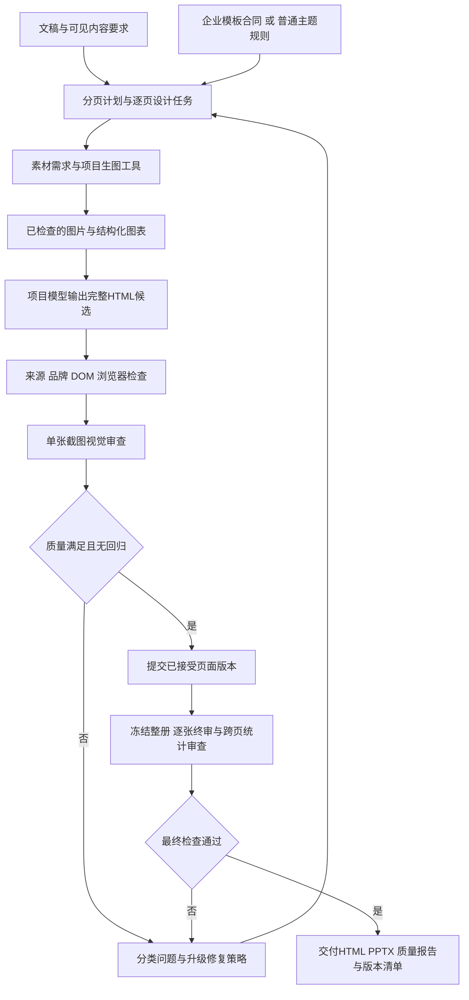

# 网页PPT Agent工作流审计与改进路线

> 后续实施更新：用户进一步授权系统优化后，企业v5已进入代码实现与真实模型联调。请以[企业工作流v5实施与验收](企业工作流v5实施与验收.md)区分已实现、已测试与尚未验收；本文下方保留最初只读审计时的记录。

审计日期：2026-09-30（Asia/Shanghai）。目标：让项目自己的Agent完成企业及非企业网页PPT的规划、配图、完整HTML设计、检查、修复和交付；以实际结果衡量是否超过118。

**结论：基础能力已经具备，但还没有形成可信的自动质量闭环。主要障碍是完成状态、候选版本、修复动作和素材编排，不是缺少几个skill名称。** 本轮按“先记录”要求进行代码审计、运行证据核查和118技术问答，没有修改运行代码、重启服务或重新生成PPT。

## 1. 本次核实了什么

- **118连接正常**：指定会话完成第25、26轮技术问答，结束状态idle。前后作品ID、版本和页数完全相同；本次未要求生成、编辑或导出PPT、页面、图片。凭据未写入归档，临时认证客户端已退出。
- **两条本地流程确实分叉**：普通模式以规划、容量编辑、少量重点页模型设计及母版/原型复用为主；企业模式以模板合同和逐组完整HTML为主。它们共享部分工具，但没有共同的候选提交、问题队列和最终验收机制。
- **运行中的56页任务尚不能当作最终成品**：12:36取样时，项目99162889的优化任务仍在第一轮、第25页附近。16个修复组已有记录，10/11/19页回滚。此处是时间点证据，不是持续更新的进度页。
- **撤回第18页缺标题的判断**：任务截图、此前本地副本、预览服务、独立浏览器渲染四张图逐字节相同，标题可见。没有证据支持该缺陷，也不能把它归因于缓存。该项已从本地当前问题清单撤回，历史记录保留纠正说明。

证据入口：

| 材料 | 用途 |
| --- | --- |
| [企业流程审计](resources/enterprise-audit.md) | 8项问题的代码位置、运行证据、建议和验收 |
| [普通流程审计](resources/generic-audit.md) | 12项问题、图片/图表/内容政策及兼容迁移 |
| [118第25轮](resources/118-round-25.md) / [第26轮](resources/118-round-26.md) | 本次提问与完整回复 |
| [118连接记录](resources/118-connection-evidence.json) | 会话状态、事件序列、前后作品对比 |
| [运行任务证据](resources/enterprise-job-evidence.json) | 56页任务的取样数据 |
| [第18页复核](resources/render-evidence-audit.md) | 截图、哈希、DOM与撤回依据 |
| [源码指纹](resources/audit-source-manifest.json) | 当前未提交工作区的源码哈希；不等同于后台进程已加载所有修改 |
| [视觉调用与费用核查](resources/vision-usage-check.md) | 13:10取样：218次真实响应、117次本地缓存；解释用量与扣费的区别 |
| [与Codex工作方式对比及三模型优化方案](与Codex工作方式对比及三模型优化方案.md) | 在GLM、Seedream、Seed固定分工下补齐诊断、工具、版本和终审 |

详细报告里的代码行号对应本次工作区。下文使用统一优先级：P0阻碍可靠自主交付，P1明显影响质量或效率；详细分报告的原始评级不直接用于横向比较。

## 2. 现在的流程和不合理之处

普通模式实际顺序：读文稿 → 准备/复用素材 → 分析风格参考 → 规划大纲 → 编辑容量与布局 → 项目工具生图 → 重点页模型HTML/母版复用 → 浏览器检查及导出 → 全册逐张视觉审查 → 有限页面修复 → 任务结束。

企业模式实际顺序：前端拆分和打标、发布模板 → 分析模板约束 → 选择页型并分组 → 模型输出完整HTML → 来源/固定元素/浏览器检查及纠错 → 全册导出 → 逐张视觉审查 → 正文换模板或重写候选 → 浏览器及视觉复查 → 任务结束。

项目配置模型负责设计和修复；Codex本次负责审计。模板打标仍应作为模型分析依据，不能把中央示例排版全部机械锁死。人工明确的品牌保护则必须持续有效。

| 优先级 | 已证实的问题 | 为什么影响成品 | 依据 |
| --- | --- | --- | --- |
| P0 | `completed`与质量通过未分离 | 视觉`needs_review/incomplete/disabled`仍可能显示完成；普通相同参数重试还可能复用旧结果 | G01、E1 |
| P0 | 缺统一的验证后提交机制 | 企业先写公共plan再检查，异常才回滚；普通候选视觉复查仍需修复时，也可能保留新版。缺少可靠的“最好已验收版本” | G05、E2 |
| P0 | 修复动作不足以覆盖根因 | 普通只能有限修页，排除chart、禁止补图、不能重分页；企业虽能重写HTML、换正文模板和重析合同，修复仍锁定原分组页数。缺图、需续页等问题容易陷入反复改版 | G02/G04、E3 |
| P0 | 企业素材编排未接通 | 工程中有Seedream工具，但企业入口没有调用普通资产规划/生成链；不是模型“偶尔忘记生图” | G06 |
| P0 | 内容验收语义不一致 | 普通“来源完整”主要指备注完整，缺少关键事实必须可见的验收；企业则要求实际HTML覆盖源块 | G08 |
| P1，实施前置 | 一页候选触发整册重渲染 | 56页任务中，大量未修改页面反复渲染，失败回滚再渲染，放大每轮修复时间 | E5 |
| P1 | 单页pass不证明变好或整册协调 | 缺候选与旧版的改善比较、跨页设计审查、冻结版本的报告绑定。短标签断行可能被low放行 | E4、G10 |
| P1 | 重试、恢复和问题记录分散 | 多层“3次”相乘；旧人审反馈恢复时重新并入，未绑定已修复版本；缓存命中usage不能当新增消耗 | E6/E7、G12 |
| P1 | 普通设计受重点页配额和母版优先约束 | 布局brief不保证真正执行为模型设计；母版不合适时缺可靠的拒绝/替换闭环 | G03 |
| P1 | 图片与图表工具覆盖不足 | 普通主要三个图片槽；缺生成后内容/构图验收；企业图表适配只有单列单序列；chart无法进入普通视觉修复 | G06/G07/G09 |
| P1 | skill与代码策略漂移 | 文档仍有多图审查描述，而实际已单图；修复轮数和动作能力不一致；仅交接skill无法复制效果 | G11 |

现有正确能力应保留：来源ID和数字校验、企业固定品牌保护、真实单张截图审查、模板不可变发布版本、图表宿主取数、失败记录、预算控制，以及模型完整输出企业页面HTML。

### 三个真实失败说明了什么

- **第10页**：最后候选正文从x=44开始，合同要求x≥60。应明确修复几何边界并复测。
- **第11页**：来源块b0018坐标在允许区域内，但不是正文容器的DOM后代。应修DOM关系；反复挪坐标无法解决。
- **第19页**：来源块b0039超正文底部约62px。需要检查内容容量、模板选择和是否应续页，不能一直缩字或全页重写。

这三类错误不能无证据地都归为“模型格式错误”或“反馈丢失”。错误分类决定Agent应调用什么工具。现有3次自纠错仍有价值，但同一种无效操作不应成为唯一动作。

## 3. 118能提供哪些参考，哪些不能照搬

本次118自述其可见工具包括页面读写、增删排序、`render_probe`、截图、生成/编辑图片、加载skill。它描述的关键依赖是：图片产物先存在再引用；先规划再生成；分批截图检查，问题回到Agent修改后复测。

需要保留三个证据边界：

1. **可见工具和skill说明不等于私有后端源码**。第25轮确有只读`list_works`和`read_file`事件，但其余工具本次没有逐一实测。
2. **第26轮的公共协议、候选目录、增量渲染、问题台账都是工程建议**，不能写成118已经具备的完整实现。
3. 118说当前可见工具中没有独立整册验收工具，同时承认引擎隐式门禁未知。因此不能断言其整个后台没有终审机制。

118建议先改整册重渲染、候选覆盖和企业生图缺口。本地审计基本同意，并将质量状态和错误升级一并提前：否则即使渲染更快、图片更多，也可能更快地产出未验收版本。

它把反复越界概括为“内容与骨架不匹配”也不能直接作为所有问题的诊断：第11页是DOM关系问题，和内容量无直接对应。建议必须服从本地可复现证据。

**无需拿到118的工具源码才继续。** 我们可以独立实现浏览器测量、候选事务、素材工具和质量状态机；参考其设计原则，但保留来源校验与企业模板保护等自己的能力。

## 4. 最可行的目标架构：共同执行流程，分别定义设计约束

以下全部为待实施方案，并非本轮新增功能。

循环有持久化资源上限和无进展退出条件；并不承诺无限调用就必然变美。到上限仍有问题时交付可预览草稿和未解决项，状态为待复核。

### 4.1 共用协议与设计政策

| 共用对象 | 最低需要表达的内容 |
| --- | --- |
| `ContentContract` | 原稿版本、稳定来源ID、必须可见事实、逐字/提炼政策、数字单位、允许备注项 |
| `DesignPolicy` | 16:9画布、主题、字体、页型、人工固定品牌、允许编辑区域、图表/图片权限 |
| `PageBrief` | 稳定slide_id、叙事用途、来源块、容量、布局意图、素材需求、选择理由 |
| `AssetManifest` | 实际文件与hash、提示词/模型版本、用途、裁切区域、生成/复用来源、检查结果 |
| `PageRevision` | HTML制品、设计元信息、合同/字体/资产/渲染器指纹、候选与接受状态 |
| `Issue` | 稳定issue_id、slide_id、observed_revision、规则/视觉证据、严重性、已试动作、解决版本 |
| `QualityReport` | 页级及整册结果、未验证项、截图hash、验收策略版本、冻结的deck_revision |

企业策略保护Logo、品牌、页眉页脚和固定页布局，正文按模板色板、字体和安全区自由设计。封面/目录/章节/尾页尽量替换内容；序言仅在文稿明确标注时使用，有对应模板则位于封面和目录之间，没有则按正文处理。正文打标是分析线索，模型推断的锁定项要有依据并允许重新分析；人工明确固定品牌不可自动解锁。

普通策略允许更大的构图与叙事自由，母版可以作为初稿，但每页都接受同一质量检查。共享执行流程不表示所有页共享固定版式，也不要求每页机械地从零写HTML。

宿主负责验证、资产引用展开、存储和导出；模型负责设计候选。**企业页面继续由模型完整输出HTML，不退回一堆规则填正文框。** 设计元信息和完整HTML建议拆为两类制品，减少HTML嵌JSON的转义返工；实现时仍须验证文档完整、资源合法和合同一致。

### 4.2 自我修复应具备的动作

| 问题类别 | 优先动作 | 无改善后的升级 | 不变量 |
| --- | --- | --- | --- |
| JSON/输出格式错误 | 协议纠错，保留原任务反馈 | 切独立HTML制品输出协议 | 不把业务错误覆盖成只有解析错误 |
| DOM包含关系/引用错误 | 模型局部修结构或引用 | 重建正文容器 | 来源、固定品牌不丢 |
| 孤字、短标签断行、局部越界 | 换行、宽度、对齐与合理字号 | 重排局部组件 | 语义单元完整，不靠极小字塞入 |
| 正文太密/留白失衡 | 换构图、正文变体 | 重析模型推断的区域，再显式续页 | 不静默删原稿，更新目录页码 |
| 图片缺失/不合题/不适合裁切 | 复用、项目Seedream生成/编辑、资产复查 | 改构图或记录降级方案 | 固定品牌图不替换；不强求每页生图 |
| 数据图长标签/系列拥挤 | 调图型、图框、标签和行子集 | 分图/续页 | 数值由源单元格取，不用生成图冒充数据图 |
| 多页风格漂移 | 更新页级设计任务与共同主题约束 | 重审所有受影响页 | 所有旧报告按依赖变化失效 |

建议按错误指纹累计同类尝试，连续两次无改善时评估升级；“两次”是可配置起点，需要样本验证。网络重试、格式纠错和设计尝试应分开统计，并遵守用户要求的局部纠错上限，不能层层套3次后失去全局控制。

### 4.3 候选版本与渲染

候选写入独立目录；检查报告只属于这个候选。通过硬检查、视觉检查和无回归比较后，原子更新接受指针；多页拆分用deck_revision完成批次提交，不能靠逐页乐观锁假装跨页事务。

每次只渲染修改页及依赖页。主题、画布、全局CSS、字体包或渲染环境改变时，应扩大失效范围；某张图片改变时，至少重验引用它的页面。最终整册冻结后再生成交付版本，校验HTML、截图、报告和下载产物指向同一版本。

预览可以同时提供“已接受版”和“当前候选”，但必须清楚标识。运行中的候选不应覆盖用户唯一可信版本。

### 4.4 视觉检查要对美观有帮助

继续遵守“一次一张成品截图”，不改回多图请求。先验收代表页，再按小批次生成；把单页结果和样式统计汇总给项目导演，用于后续页设计。固定模板参考图单独分析。

终审使用独立审查上下文，输入截图、原始浏览器报告、页面约束和来源要求；不提供生成方的“我已经通过”结论，减少顺从。独立上下文不保证绝对客观，最终仍需用人工盲评标定标准。

2026-09-30用户进一步明确：认可GLM的内容/HTML输出，希望图片和排版视觉分析交给视觉模型，不要求替换HTML生成模型。当前参考图和成品截图已经由火山Seed视觉模型分析；GLM接收文字反馈、来源、合同和HTML。后续应加强视觉诊断协议：描述问题区域、证据、层级/密度/留白原因、建议动作、验收条件和不确定项；涉及精确坐标或DOM归属时由浏览器核实，再由GLM完整输出修改后的HTML。保留独立上下文的单图视觉复查，避免让生成方自评代替验收。

把短时间标签断行、孤字、信息主次混乱、图表不可读列为可行动问题；留白多少、冷暖偏好则结合设计任务判断，不能把所有个人喜好升为硬错误。除了排除错误，还应评价层级、构图平衡、可读性、图文关系和整册节奏。模型自评分不能单独作为“胜过118”的证明。

### 4.5 图片模型与费用边界

本机普通生图配置为Seedream `doubao-seedream-5-0-flash-260915`，目标2048×1152；截图视觉配置为 `doubao-seed-2-1-pro-260915`；文本设计使用GLM。这里是项目配置核查，不表示本轮新调用或验证了生图服务。

图片请求上限100、视觉请求上限1000；图片类20元和图片/视觉合计100元是本地预留限制，**不是账户余额或实际扣费**。次数上限调大不会自动增加修复动作覆盖，也不会绕过金额限制。新执行器需区分缓存命中、实际请求、预留、确认usage与服务商账单。本轮未新生成图片。

## 5. 实施顺序与兼容策略

| 阶段 | 具体交付 | 必须通过的验证 |
| --- | --- | --- |
| A：可信版本与状态 | 统一质量状态、候选目录、报告绑定、接受指针；同时或紧随补单页渲染工具 | 在写候选、检查、提交各阶段中断，旧验收版不丢；只改1页不重渲整册；未验证不显示合格 |
| B：能解决根因 | 问题队列、策略升级、正文换模板/区域重析/续页、图表修复、持久化尝试次数 | 复现10/11/19类问题并自主处理；12个问题页不因每轮3页限额永久遗漏；无Codex修改HTML |
| C：图文设计闭环 | 两种模式共用资产需求、Seedream工具、素材验收；代表页及分批反馈影响后续设计 | 企业Agent能自主生图、引用、复查，固定品牌不变；图不合适可以重选；来源数值全对 |
| D：可比较的终审与交接 | 冻结版本终审、跨页检查、基准样本、质量/成本指标、工具适配包 | 从正常前端启动到交付无需Codex补图改页；回归集通过；盲评证据与终版对应 |

原普通网页PPT流程保持默认。新执行器按任务`workflow_version`启用，候选、缓存和报告隔离；先共享稳定工具，再迁移生成与修复决策。使用固定样本对照验收，并经用户或产品方明确确认后才切换默认，避免企业功能通过共享模块悄悄改变普通任务。不会默认付费双跑所有生产任务。

本轮只记录，不对当前优化进程热切换逻辑。当前工作区与在途进程可能存在已加载代码差异，后续部署需要明确版本和任务迁移边界。

## 6. “超过118”如何验收

测试集应在调参前确定，保留未参与调参的样本。两种模式都覆盖：封面及元信息、目录/章节/序言、长正文、短数字标签、宽表格、多序列图表、场景配图、弱打标模板、缺素材/字体、较长整册，以及服务失败和进程中断。

验收分三层：

1. **硬性项**：关键事实与来源正确、约定的可见内容覆盖、固定品牌保护、无溢出/裂图/明显遮挡、无未验证页冒充通过、所有报告绑定实际交付版本。
2. **自主性与效率**：无需Codex改页/补图的交付比例、同类错误修复成功率、新缺陷回归率、人工干预次数、耗时、实际模型请求及费用；缓存逻辑调用单列。
3. **审美结果**：匿名打乱两版成品，由人评价单页与整册的层级、可读性、构图、图文关系、企业保真和节奏，保留理由与分歧。不能只依靠同一模型自评。

118对照仅使用已经获得且允许使用的成品，本次不会让118生成测试稿。若没有相同文稿、模板和内容要求的对照，只能报告风格差距和本地前后改进，不能声称公平比较中已经胜出。后续有同输入、相近资源约束的成品时，再报告成对盲评胜率及样本数量。

交接物应是**可执行工具、实际加载的skill、输入协议、测试样本、报告与失败恢复说明**。已有[交接基线](../enterprise-ppt-agent-handoff/README.md)可作为起点，但它和本审计路线都不能被包装为已经验收完成的产品。

## 7. 本轮工作日志

- 2026-09-30：并行审计普通、企业和渲染证据；不改变在途任务。
- 12:34–12:36：第18页四路渲染复核，撤回缺标题判断；记录任务中途证据。
- 12:38前后：118第25、26轮技术问答完成；只读工具及文字讨论，未生成或修改作品。
- 归档：保存两轮问答、连接状态、源码指纹、分项审计、截图证据；更新历史调研日志和误判纠正记录。
- 本轮未新增运行功能、未执行生成质量回归、未宣称当前56页通过最终验收或已超过118。
