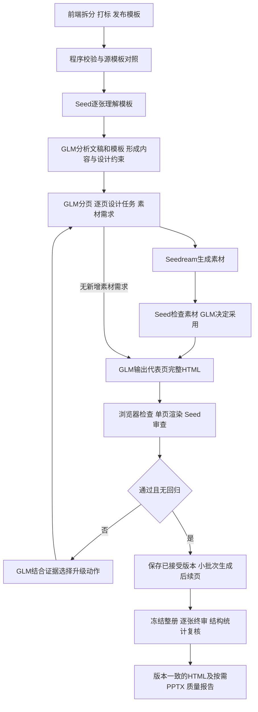

# 企业模板网页PPT：与Codex工作方式对比及三模型优化方案

日期：2026-09-30。本文是审计与方案记录；未修改生成代码、替换模型、重启任务或生成新PPT。

## 结论与比较范围

继续采用GLM进行文字分析、规划、决策和HTML输出，Seedream生图，Seed做图像分析，可以构建所需工作流。当前已接通完整HTML生成、来源/品牌校验、Seed单图审查及部分正文模板重选；欠缺的是可执行的诊断、策略升级、版本和最终验收机制。

比较对象为本机安装的Codex Presentations skill中可见的模板处理和检查要求，以及本次工作中Codex能执行的读图、读DOM、测量、分析日志和复核操作。这不是Codex私有后端的还原，也不是已完成的同稿质量对照实验。不能据此断言三种模型已经达到Codex效果，或Codex自身不会误判；第18页观察的撤回正说明所有审查者都需要证据复核。

可见参考要求包括：先检查源模板所有相关页、保留真实字体/母版/重复元素、在副本工作、渲染后对照原稿、检查每页及整册节奏、分别验证结构与视觉、检查实际导出文件。自动检查通过并不能证明设计好看。依据：本机[模板遵循说明](/Users/duxiao/.codex/plugins/cache/openai-primary-runtime/presentations/26.915.20218/skills/presentations/references/template_following.md)、[视觉设计说明](/Users/duxiao/.codex/plugins/cache/openai-primary-runtime/presentations/26.915.20218/skills/presentations/style_guidelines.md)、[交付检查说明](/Users/duxiao/.codex/plugins/cache/openai-primary-runtime/presentations/26.915.20218/skills/presentations/references/finalization.md)。

这些原生PPTX规则须按网页PPT目标适配。用户要求模型完整输出HTML，所以不照搬占位符填充或原生幻灯片复制作为正文生成方式；用户要求全文保留时也不能照搬默认的精简建议。前端拆解/打标保持现有职责，不迁往后端。

OpenAI官方说明将skill定位为工具的调用顺序、分支、缺失结果处理和交付指导，实际工具负责受控操作。因此，移植文字规则并不能自动获得对应执行能力。[官方skill说明](https://developers.openai.com/plugins/concepts/skills)

## 一、固定模型分工

| 承担方 | 职责 | 不应替代的事实依据 |
| --- | --- | --- |
| GLM | 文稿理解、内容合同、分页、模板匹配、设计任务、图片brief、工具选择、错误原因分析、完整HTML生成与修复、整册文字决策 | 不凭文字描述臆测未看到的图片；不擅自删原稿或解除品牌锁 |
| Seed | 看模板图、成品图、生成素材；输出可见问题、视觉角色、区域、影响、建议、复验条件和不确定性 | 不单独决定原稿事实、精确DOM坐标或自动修改模板权限 |
| Seedream | 根据GLM的素材brief生成或编辑图片；按版面需要构图、留白、比例和主体一致性 | 不生成需要精确数值的统计图，不重画必须保持的企业Logo |
| 浏览器与程序工具 | 字体/资源检查、DOM与文本测量、来源/数值校验、固定元素保护、渲染、增量依赖、候选版本、导出和状态 | 不替GLM规则拼装正文，也不以无溢出冒充美观 |

Seed输出文本/JSON只是图像分析的结果格式，不表示让Seed接手文稿分析或HTML设计。GLM仍是项目决策与文本输出模型。上述职责不需要增加第四种模型。

## 二、具体差距与优化

| 环节 | 可借鉴的工作方法 | 当前项目状态 | 应补齐的能力 |
| --- | --- | --- | --- |
| 模板入库 | 看真实源模板，确认字体、母版、裁切、重复元素和实际尺寸 | 已有前端解析、字体提示、人工确认及发布快照 | 源PPTX渲染与导入HTML的对照证据；字体来源、实际回落和丢失元素清单；验收基准绑定模板版本 |
| 模板理解 | 综合截图和结构判断什么是品牌、什么只是示例内容 | 前端标签＋Seed视觉分析＋GLM合同已存在 | 逐元素记录标签来源、视觉角色、浏览器矩形、锁定理由、置信度和冲突；允许重新分析模型误锁，保留人工品牌锁 |
| 视觉到代码 | 看清问题，再查看对应对象与代码，核实后修改 | 已传visual_analysis、observed、detail、fix_hint，不能称链路未接通 | 有稳定ID和版本的视觉诊断；浏览器将图像区域对应到DOM与来源块；原始问题不被导演摘要丢失 |
| 内容适配 | 根据内容量改变构图，必要时换页型/续页 | 初始生成支持拆分，修复仍锁原分组页数；固定页与正文动作不同 | 让实际工具支持正文续页、目录重排、页码更新、图表重规划；不只在skill里写允许拆页 |
| 设计形成 | 有明确页级表达目标，先验证代表页，再推广 | 全册先生成，视觉反馈偏后置 | 每页有内容关系、视觉重点、布局意图与图片需求；代表页验收后小批次生成，反馈进入后续brief |
| 素材 | 根据使用位置准备图片，看过后再使用 | 普通有素材链，企业入口尚未接通；文件可解码不等于视觉合格 | GLM规划→Seedream产图→Seed检查→GLM决定采用/重试/换构图，素材版本及裁切依据可追踪 |
| 修复策略 | 遇到重复失败，重新检查假设或换方法 | 有3轮纠错与正文模板重选，但缺全局错误分类和升级状态 | 用问题台账调度DOM修正、改构图、换正文模板、重析合同、补图、图表修复、续页，记录每次改善 |
| 保留结果 | 在副本试验，对照修改前后，再保存更好结果 | 企业候选先覆盖plan再检查；普通视觉失败候选的回退行为不统一 | 候选独立、报告绑定revision、保留最后已接受版本；多页改动批次原子提交 |
| 整册与终稿 | 逐页看真实输出，同时检查页序和一致性 | 单页审查已存在，但completed仍可伴随needs_review；缺冻结终稿的证据闭合 | execution与quality分离；冻结版本逐张审查＋GLM基于结构化统计检查整册；最终HTML/截图/报告一致 |
| 交付格式 | 检查交给用户的文件，而非只看中间截图 | 网页浏览器检查已有；PPTX应用渲染状态仍pending | 网页优先检查独立打开、字体与资源；如交付PPTX，再检查实际渲染、表格/图表可编辑性与源数据 |

当前前端已经有字体和导入警告确认，不能写成完全没有模板验收。缺少的是从真实源文件到导入快照、运行字体再到导出结果的连续证据。保存了sourceFont不等于实际使用了该字体，也不能因为旧样例发生system-ui回落就断言当前解析器所有字体都回落。

企业PPTX导出目前包含底图、可编辑文字及部分原生图表；正文HTML表格不自动等于原生可编辑表格。网页质量和PPTX质量应分别报告，后者按实际交付需求安排，不阻塞纯网页目标的独立评价。

本地控制流与问题证据详见[企业审计](resources/enterprise-audit.md)、[普通审计](resources/generic-audit.md)、[渲染证据复核](resources/render-evidence-audit.md)。

## 三、最需要加强的接口：Seed诊断到GLM修复

当前issue包含severity/type/detail/fix_hint，已有作用。下一步建议扩展为：

```json
{
  "issue_id": "issue-008-label",
  "slide_id": "slide-008",
  "observed_revision": "page-revision-id",
  "screenshot_sha256": "actual-image-hash",
  "visual_evidence": "时间区间在圆形节点内分成两行，第二行偏离中心",
  "region_hint": "正文时间轴第一个圆形节点",
  "source_or_element_ids": [],
  "severity": "medium",
  "suggested_action": "调整标签容器或将标签置于节点外",
  "recheck_criteria": "区间完整单行、无遮挡、与时间节点关系清楚",
  "uncertainty": "精确宽度与DOM归属待浏览器确认"
}
```

这是建议协议，不是现有返回结构。Seed提供视觉证据及区域提示；浏览器补充真实DOM/来源ID、容器宽度、行数、字号和关系；GLM据此判断是换行、DOM错误、容量不足还是合同误锁，再调用对应动作并完整输出HTML。

区域不明确时允许Seed再次看同页的局部裁切，仍保持每个请求一张图片；裁切带有原图版本和偏移，不能用来替代整页复核。视觉模型不可靠地估计像素时，应返回不确定，不编造精确测量。

原模板与成品仍分开请求；二者的观察通过同一模板元素ID和版本衔接。全册风格判断交GLM读取各页结构化观察和程序统计，而不是要求Seed从一张图猜整册。

## 四、让失败原因决定工具

真实例子：第10页正文左越界，浏览器测量可直接定位；第11页来源块在视觉区域内但DOM归属错误，要修父子结构；第19页内容超下界，可能需要更适合的正文变体或续页。统一要求“再生成一遍”会浪费调用。

建议持久化处理流程：观察 → 核实 → GLM分类和选工具 → 生成候选 → 来源/品牌/浏览器硬检查 → Seed单图复核 → 接受或保留旧版。相同根因在同种动作下无改善时，升级策略；3次局部自纠错上限、网络重试、格式纠错和整册轮次分别计数，防止隐含相乘。

遇到人工品牌保护与容量冲突，应保留品牌并尝试授权的正文变体/续页，显示具体冲突；不能自动取消人工锁。模型自行推断的正文装饰锁可以重新分析，修改合同也必须形成候选版本并复核。

## 五、建议的完整流程



终审不过时回到问题队列；达到资源上限或没有可改善候选则保留草稿和未解决项。图中每个“通过”都有对应版本证据，不以单次模型自评代替全部条件。

## 六、优先级与验收

第一批：**视觉证据协议、真实DOM测量、候选事务、质量状态、单页增量渲染**。用第8页短标签、第11页DOM关系、第19页容量问题验证：GLM能收到准确原因，修改对象正确，不覆盖更好旧版。100页中仅一页变化时，只重渲染该页及明确受影响页；主题/字体变化时扩大失效范围。

第二批：**修复动作升级、代表页反馈、企业素材链、图表工具**。复现“技能说能拆页、工具却不能”的边界并消除它；企业有配图需求时由项目Agent自主调用Seedream和Seed，所有关键事实与品牌保护仍通过。图表由结构化数据工具固定取数，GLM可改图型、标签、分组与分页。

第三批：**模板入库对照、最终整册验收、持续样本评测和可运行交接包**。重要导入缺陷需前置发现，完整自动化对照可逐步补齐。固定样本覆盖短标签、长正文、弱标签模板、缺字体、目录/章节/序言、宽表格、多序列图、素材失败及中断恢复。以无需Codex改页的成功率、错误回归、盲评审美、模板保真、耗时及实际费用比较。

性能优化优先减少无效循环和多余工作：只重渲染相关页；给GLM稳定的模板/主题上下文，附本页来源和相关错误而非累积无关历史；HTML制品与元信息分离，减少转义纠错；无依赖的页面候选可有限并行，待候选事务成立后再启用。局部修改任务仍要求GLM输出完整HTML，不改回宿主规则填框。

原普通流程保持默认，在途任务不切换逻辑；新能力以workflow_version和任务级开关接入，缓存、候选和报告隔离。通过固定样本验收并获得既定范围内的切换授权后再迁移默认流程。

交接同事时交付运行时、工具输入输出、能力清单、实际加载的skill、模板前端协议、模型适配器、样本和验收脚本。优先一个总编排skill加按需参考文件；模板理解、资产、视觉诊断和修复规则可分资源，不必机械增加Agent或skill数量。

## 七、明确未完成项

本文没有实施上述改造；仍有在途优化任务。未做同输入的Codex/项目Agent盲评，不声称达到某个百分比或已超过118。所需工具能力可以在现有三模型组合中建设；模型判断能力的实际差异需要样本验证，不能靠流程文字保证消除。
