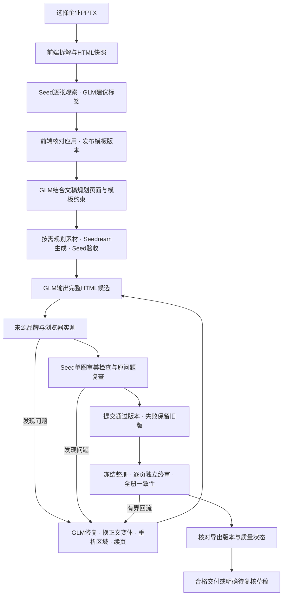

# 企业网页PPT工作流 v5：实施与验收

适用：16:9企业PPTX、完整文稿、GLM文字与HTML、Seedream生图、Seed视觉分析。2026-09-30实施。本文随真实联调更新；代码实现、自动化测试与成品审美验收是不同状态。

## 问题和本轮改法

| 原问题 | 本轮实现 | 仍须实测的边界 |
| --- | --- | --- |
| 规则打标不能充分理解图片、转曲文字和复杂目录 | 前端快照→Seed单图观察→GLM标签建议，显示置信度/冲突，前端确认应用 | 特殊字体、复杂组合图形、原PPTX与浏览器之间的还原差异 |
| 生成完整册后集中排错，单组修复反复渲染全部页 | 按来源组保存独立候选，只渲染本组；整册渲染留到终审与导出 | 极长单组、跨页表格与超过200页的容量 |
| 原分页锁死，反复缩字号仍不好看 | 正文/目录/序言允许模型续页；正文可重选同企业变体、重析区域 | 不允许因此移动固定标题、修改来源或解除人工品牌锁 |
| 视觉反馈泛泛，前后版本容易混淆 | 稳定slide_id、slide_version、HTML/截图hash、DOM来源位置、问题ID与复验条件 | Seed仍可能误判；版本对应不能消除模型视觉误差 |
| 修复版本直接覆盖较好版本 | 候选目录和已接受指针分开；坏候选不覆盖通过版本；崩溃恢复验证证据 | 相同环境外的字体/浏览器版本变化需要重新验收 |
| 企业分支没有生图编排 | GLM需求规划→Seedream→Seed单图素材验收→资源别名→正文引用校验 | 没有表达需求时可不生图；图片数量不是美观指标 |
| completed被误解为质量通过 | 新增quality_status、ready_for_delivery、quality-report.json；待复核明确为草稿 | 只有完整关卡通过才能标ready；不把下载可用当验收通过 |
| 末轮修复后缺独立终审 | 冻结整册→逐页Seed独立审查→GLM整册文字证据审查；问题回流一轮并再次终审 | 全册审查依据逐页观察，不宣称GLM看到了图片 |
| 重新执行可能重置调用次数 | 输入指纹和模型调用检查点持久化；共享图片/视觉预算 | 调用尝试数与供应商真实token/费用分开统计 |

## 从选择PPTX到交付

1. **前端导入。** 浏览器拆解PPTX，保留页型、元素坐标、字体、颜色、原资源、转曲文字和导入警告，生成逐页HTML；只支持16:9。
2. **自动分析与建议。** 浏览器为该页结构和HTML计算快照版本。服务端在禁止外部联网的渲染环境中截图。Seed每次看一张图；GLM仅接收元素和视觉观察，提出页用途、文字标签、配对序号、置信度与理由。
3. **前端确认发布。** 默认选中置信度至少0.75且非人工锁的建议。应用前重新计算快照，拒绝过期建议；人工标签不自动覆盖。发布后主界面自动选择该模板。后端分析接口不发布、不修改标签。
4. **文稿规划。** GLM提取标题、元信息与章节，按稳定来源块规划页面和企业变体。原文和数字完整保留。序言仅接受明确序言范围，模板没有序言时按正文处理。
5. **模板约束。** Seed理解参考截图；GLM提出品牌/背景保护、固定文字外框、正文自由区。程序校验冲突并把具体错误交还模型。标签是参考，人工品牌保护是约束。
6. **素材准备。** GLM按正文表达需求规划素材，默认单任务最多4张新增图；每张Seedream图片必须经过Seed验收，之后以别名交给HTML模型。Seed明确拒绝时，GLM依据具体问题修改提示词，最多初次加3次纠错；任务身份和用途保持不变。保留服务端角落AI生成标识，不把来源标识误作缺陷。共享已有总预算和次数上限，不在续跑时清零；新图前预检图片加一次验收的预算。统计图走来源数据工具，不用生图伪造数据。
7. **完整HTML生成。** GLM生成完整单页HTML/CSS，可把一组续成多页。宿主展开已知资源、检查来源与品牌；不替模型拼正文，不用Codex产图或手改页面。
8. **逐组检查与修复。** Chromium检查实际几何、出界、遮挡、字号和来源位置；Seed逐张检查可读性、层级、对齐、间距、密度、对比、构图。反馈包含当前版本、真实DOM候选和复验条件。GLM据此重写，持续问题需考虑换正文模板、重析区域或续页。每组最多初次加3次纠错，失败保留草稿和证据。
9. **候选提交。** 通过硬检查可作为草稿查看；完整视觉通过才标该候选accepted。候选不能覆盖已接受版本为较低状态。任一候选和提交记录都绑定输入、模板、HTML、截图及检查文件。
10. **冻结终审。** 校验全册来源、页数、目录与顺序；渲染全部最终页，用独立上下文逐张Seed审查；GLM根据逐页观察检查叙事重复、跨页风格漂移和重点表达。问题定位回生成组再修一轮，然后重新冻结和终审。
11. **导出与状态。** 输出网页HTML与可用PPTX，并比对导出截图是否等于终审版本。质量报告列明未处理项。浏览器/内容硬检查未过只能导出带状态的HTML草稿；不能把旧PPTX冒充新结果。PPTX原生应用的渲染一致性另行验收。

## 职责和交接边界

| 角色/模块 | 职责 |
| --- | --- |
| 前端 | PPTX解析、HTML快照、标签应用、确认/发布、选模板、看逐页草稿 |
| GLM | 文稿语义、标签建议、合同、分页、变体选择、配图任务、完整HTML、修复和整册文字证据审查 |
| Seedream | 概念素材生图；不生成整页PPT或统计图 |
| Seed | 单图观察、素材验收、页面美观诊断、修复复查和独立终审 |
| tools | 来源/品牌/图表数据校验、浏览器测量、版本与检查点、预算和产物导出 |
| Codex | 开发工具/skill、测试和独立看图审计；不参与运行中页面生产 |

这份系统不是下载到的118私有实现。本地skill与tools由本项目实现，借鉴了技术问答中的检查方法；没有证据证明其私有实现与本项目一致，也尚无同稿盲评证明效果超过118。

## 接口与证据

- `POST /api/enterprise-templates/{template_id}/analyze-page`：前端页快照，返回建议；严格保留快照版本。
- `PUT /api/enterprise-templates/{template_id}`：仍由前端保存标签及发布版本。
- `POST /api/runs/import`、`POST /api/runs/{run_id}/presentation`：文稿与选定模板触发项目Agent。
- `POST /api/presentations/{job_id}/optimize`：复制到同项目新版本，保留原稿；可附逐页反馈。
- `POST /api/presentations/{job_id}/resume-optimization`：继续中断/待复核企业任务；输入必须匹配检查点，计数不清零。
- 新任务字段：`enterprise_workflow_version=5`、`quality_status`、`ready_for_delivery`、`artifacts_available`。
- 证据文件：`workflow-checkpoint.json`、`source-plan.json`、`enterprise-design-contract.json`、`enterprise-assets.json`、`revision-state.json`、`candidates/`、`final-audit-*.json`、`frozen-plan.json`、`quality-report.json`、`visual-review.json`、工具trace和原始模型回答。

## 验收进度

- 已通过：前端构建、真实Chrome模拟API完整交互、单页恶意快照外部请求阻断、前后端协议与来源/品牌回归、候选回滚/恢复/页数上限、独立终审回流等离线测试。
- 已真实调用：一页企业模板的前端快照分析，Seed + GLM返回正文标签建议；前端应用并发布到隔离验证库。
- 已部署：18080的企业v5分支、前端自动标签入口、旧版及新版草稿状态；真实浏览器访问通过，原56页任务结束后才切换服务。
- 已完成真实7页短稿生成：项目Agent生成全部HTML，完整来源、浏览器硬检查和导出版本比对通过；HTML/PPTX可导出。Seed终审与配图验收未完成，quality_status=needs_review、ready_for_delivery=false。Codex独立检查还发现第6页说明重复、目录多余装饰等问题，不能作为美观成品交付。
- 历史预算快照：视觉/图片共用停止线100元、本地保守预留99.81元时，曾等待用户答复；这不是火山实扣账单。该待确认状态已被用户后续明确授权取代：本地图片/视觉总上限调整为200元并继续同一任务，图片单独20元上限与累计账本均保留，详见下方最新部署记录。
- 尚未证明：长文稿/多企业模板稳定无人值守美观产出；同稿超过118；PowerPoint应用内与网页逐像素一致。

## 下一步仍应优先优化的部分

1. **PPTX导入保真是上游质量上限。** 如果导入时已经替换字体、丢失组合图形或转曲文字，后续严格保持HTML也无法证明保持了原PPTX。现有字体/警告确认仍应保留，下一步需要原PPTX参考渲染与导入快照的逐页对照。
2. **把自动分析变成可检索的模板设计档案。** 当前发布快照保留模型标签及依据，但生成时的模板目录仍主要依赖用途、示例文字和标签数量。应把经过版本验证的视觉观察、图表风格、内容容量和适用结构随模板发布，供GLM选择正文变体；模板变化后必须使旧观察失效。不能让模型只凭短名称猜版式。
3. **复杂模板仍需真实样本调优。** 本次真实短稿触发了缺正文DOM容器、来源遗漏、章节数字外框和JSON格式错误。已经增强具体反馈与协议检查，但离线测试不能证明所有复杂固定页都能在3轮内自动解决。
4. **动画/字体变化下的恢复策略。** 目前候选绑定模板探针hash，渲染变化会拒绝沿用旧证据。对于合法动画图、不同浏览器或字体，应设计“保留旧版并重验”的迁移，而非直接把证据变化当模板身份变化。
5. **建立稳定审美基准。** 需要多企业模板、长短文稿、表格、图表、配图、弱打标等固定样本；记录首次通过率、修复成功率、人工介入、真实请求数和耗时，再做同输入的人评。模型评分和GLM前后比较有用，但不能替代独立盲评。
6. **费用预留与实际结算分开。** 当前保守预留账本只做停止线，不是火山账单。需在有可靠模型价格与实际usage证据时补结算状态，失败/未确认请求不能随意冲销，也不应一直把缓存命中当新增费用。

本轮先把可追溯、自修复、失败保留和真实交付门槛落地；上述边界仍需后续样本验证，不能宣称已经全部解决。

## 2026-09-30 用户逐页反馈补强

对PROJECT 99162889的56页旧稿核对发现：43个正文标题共14档字号（19–40px），原标题外框只有428px而页眉宽1200px；第8页64px圆圈挤断时间范围；第13页旧body_frame从x330开始且后来修正未应用；第20页复用原01–05箭头形状后压扁并把长标签塞进透明边缘。详见[原图与DOM审计证据](resources/user-layout-feedback-20260930.md)。

新增受限title_frame合同：正文标题依据原模板左/中/右对齐锚点扩宽，保持y/height和基线，模型说明安全区且宿主检查画布及新增区域固定前景冲突；不移动品牌背景。恢复旧页时不再覆盖较新的全局合同。浏览器新增标题真实行宽/字号/行数、正文左右留白、SVG形状与关联文字测量；SVG外接框明确不是内部安全区。Seed逐图检查上述问题，GLM整册比较同类标题并决定修复。已将35页38项具体反馈送项目Agent新版本bc11692a2bdf4a86a10a3540d5a0a88c（运行中），未修改旧成品HTML。

实测还发现“模板选择节点返回HTML”的阶段混淆：原来选择/合同分析都带完整生成Skill。已拆为本节点专用协议，生成步骤仍使用完整企业Skill，错误反馈作为分析数据而非变更输出类型的指令。暂停后续跑原任务，保留检查点和计数。

断点恢复补强：优化前的完整输入独立存为refinement-base-plan.json，按原计划SHA校验。续跑中已提交组使用RevisionStore版本，尚未处理组使用原优化输入，不能用只含前缀的plan.json把后页从零生成。该阶段离线结果376项Python通过、1skip，真实Chrome17项通过；后续完整回归见最新部署记录，美观仍须实际图审。

## 人工反馈逐项复验与运行版本边界

真实运行发现：API人工反馈虽然送给了GLM，但没有稳定issue_id，Seed没有逐项复验，普通pass可能掩盖尚未解决的原问题。最新源码已补齐以下流程：

- 人工问题按反馈hash、原页身份/版本和问题内容生成稳定issue_id，持久化原页到生成组的映射；续跑升级旧映射时不拿重分页后的当前页码重新猜原位置。
- Seed收到全部待复验问题，必须逐项给出resolved、persists或uncertain及可见证据。问题ID集合不完整、缺证据、未绑定当前HTML/截图/页面版本，均不能以普通pass替代。
- 人工问题保持原ID与源页映射，同时投射到当前来源组每张页面进行单图复验；当前组版本/HTML绑定的“问题×页”矩阵全部resolved才算完成，增减续页或页数不变但内容迁移都重新验证。旧结论与独立终审普通pass不能自动关闭原问题，也不因scope_changed永久阻塞。质量报告包含reviewer_feedback_complete及逐项状态。
- 续跑已有硬检通过的draft时先做Seed复验；没有预算、证据不确定或范围未确认时保留待复核，不因“尚未复验”重复让GLM改同一稿。有明确persist或新的可修问题才继续修复。
- 每组最多初次加3次纠错。失败后若没有已提交版本，仅在原页通过来源完整性和浏览器硬检查后保存为draft_needs_review，明确记录original_fallback；保留原页不算修复通过，不能据此交付accepted。

**历史运行版本边界：** 本节补强刚完成时，`bc11692a2bdf4a86a10a3540d5a0a88c`的在途worker在新门禁前启动，当时不能声称已经加载。本轮完成后部署新版、重启并续跑同一ID的计划，已推进至下节记录的实际部署与续跑阶段；检查点、原稿和累计调用记录保留。原第7、8、13、20页的改善仍只是Codex独立观察，不能替代Seed验收或最终美观结论。

本节当时工程记录为Python **376 passed、1 skipped**，Chrome **17 passed**，保留作历史；最新全量记录见下节。7页短稿仍为quality_status=needs_review、ready_for_delivery=false，历史56页与反馈优化稿也不能因导出可用或独立观察改善而标为美观通过。

## 多套模板通用性补强

详见[多套企业模板的通用适配](多套企业模板的通用适配.md)。本轮把左/中/右标题锚点、任意可编辑内容组件、图内与图外标签、重分页后的人工问题复验统一纳入项目skill与工具。没有按本套页码或某个固定字号修成品。浏览器提供CSS/SVG描述事实，未知填充安全区保留不确定性。

单正文外层矩形、保留一个标题、DOM文字与16:9仍是当前协议边界；多套真实模板的模型美观验收尚未完成。新代码与在途任务加载状态须分别确认，不能以离线测试通过宣称已全部上线和视觉通过。

## 最新部署、预算授权与同任务续跑

2026-09-30后续更新：用户明确授权把本地图片/视觉共享总预算上限调整为200元并继续工作。负责人已将`MARKETING_PPT_BUDGET_RMB=200`写入服务配置，正在重建API环境并从检查点续跑`bc11692a2bdf4a86a10a3540d5a0a88c`。图片单独20元上限、累计费用预留与请求账本、尝试次数、检查点和原稿均不清零。此前“99.81/100元、等待答复”只是历史停止点，不再是当前授权状态；保守预留仍不等于供应商实际结算金额。

最新标题对齐锚点、跨分页人工问题矩阵、rubric v3/缓存门禁、仅描述测量升级的严格版本兼容以及CSS/SVG通用形状证据已部署。服务端renderer与项目skill的SHA均与新版源码吻合。前端也修复了v5 `repair_progress.pages`缺失时调用`join`导致的白屏；18080真实浏览器访问无console error。

最终工程回归：Python **417 passed、1 skipped**，Chrome **21 passed**；前端生产构建通过，5种新/旧/缺省进度数据的真实浏览器mock回归通过。这里的“最终”指本轮工程检查记录，不表示成品审美通过。

该反馈优化任务第一轮已完成56页，来源完整性、浏览器硬检查和导出版本匹配通过；素材与视觉验收尚未完成。新的预算授权用于从原检查点继续真实Seed逐图复验、人工问题逐项关闭和必要修复，目前不能称为最终质量通过。7页验证稿、历史56页稿和反馈优化的已保存候选证据继续保留`needs_review`结论；最新任务结果明确后再更新交接清单与ZIP。

### 15:55 部署补记：文字清晰和请求体限制

生产API已加载`enterprise-visual-rubric-v4`并恢复同一任务，状态为running。新版要求Seed明确返回全部文字的`text_visibility`及截图依据：清晰、存在缺陷或无法确认。文字重叠、遮挡、裁切、近色背景不可读至少为medium，无法确认也不能直接通过。特殊SVG/CSS图形按实际轮廓、图内留白、图外间距和内容层级判断，不使用固定页码或统一像素间隔。

修复了复杂SVG的逐路径测量在模型输入中重复展开：完整probe仍本地保存，Seed证据摘要限制为24,000字符、完整briefing限制为64,000字符；进入GLM的历史诊断、修复比较和整册评审也使用摘要，保留原问题ID与验收条件。真实调用节省量须等新响应usage验证。此次全量Python回归为424通过、1跳过。

已完成3张Seedream素材生成并经Seed逐张验收；本次恢复复用三张缓存，没有重复生图。图像自身验收不等于图片已正确排入最终页面，也不能替代全册终审。现有56页可预览，仍为待复核草稿。
