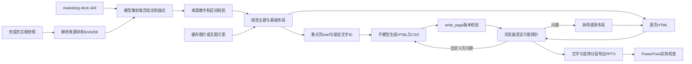
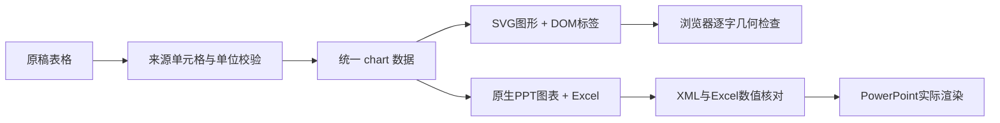

# PPT Agent：118 调研与本地实现

2026-09-24。输入是 18080 已完成文稿 `8325fe35c7fd4141a1017f4d7f7b844d`（轻芽低糖茶饮）。文稿 SHA256：`da5a6501e3373778fd0bfa06e03006cb4d0de3c9e2d4a5699566d9d18e88cb44`。凭据保留在忽略的本地环境文件中，不进入文档、源代码或 PPT。

## 关键结论

118 的可观察流程是 **主 Agent 读 skill → 规划说服链和页位 → 分析参考图 → 将视觉规则写进每页 brief → 子模型或主 Agent 写 HTML → 几何检查 → 修改与复检 → 截图审美检查 → 导出**。

skill 不是模板魔法开关。`load_skill` 返回的文本先进入主 Agent 上下文；主 Agent 决定布局、文案密度、配色和素材。`generate_page` 没有 skill/DNA 专用字段，这些指令经 `brief` 传递。图片的产品/场景主体、结论标题与信息结构共同影响观感，单纯增加配图不能修好文稿逐页铺陈的问题。

本文的【源码】指 ai-slides-web 可读前端；【实测】指本次API、下载和文件验证；【远端说明】是Agent对可见工具契约的介绍，**不是后端源码证明**；【本地】是本次实际编写的实现。完整原话见 [对话记录](ppt-research-dialogue.md)，过程见 [进展日志](ppt-research-progress.md)。

## 1. 对话接口与状态

【源码】`ai-slides-web/utils/apis/sessions.ts`、`stores/session.ts`：发送消息携带 `expected_last_event_seq`，历史按 `after_seq` 补齐，`task_run_id` 隔离任务。SSE 通知大纲、逐页完成、页面版本和 HTML/CDN 地址。

【实测】指定链接 `backend=codedeck` 使用118部署bundle中的 `/agent/_bridge/codedeck`，本地源码默认 `/api/agent_ppt` 对该会话返回404。本次始终使用118和同一既有会话 `01a0d23b7ac676f2a3f18d6de59bae39`。没有让它生成PPT或生图；仅问技术、读取skill、复制已存在资源。原有一页探针样本作品未增加页面。

## 2. 分页、布局和图片怎么串起来

| 阶段 | 118可见工具/契约 | 作用与边界 |
|---|---|---|
| 载入技能 | `load_skill(name)` → skill_md、files等 | 指导Agent决策，不直接传给生成器 |
| 规划页位 | `plan_outline(work_id,topic,materials,audience,style,page_count,extra_requirements)` | 返回pages：index/type/title/brief/status及theme；内部模型/分页算法未知 |
| 看参考图 | `understand_image(path,work_id,prompt)` | 提取主色、材质、构图、文字风格与装饰密度；视觉模型型号未知 |
| 委托生成 | `generate_page(work_id,page_index,title,brief,image_urls)` | DNA和布局写入brief；image_urls仅为实际要上页的素材 |
| 精确写页 | `write_page(page_index,content,work_id,new_brief?,attrs?,expected_rev?)` | 主Agent写HTML，expected_rev保护并发版本；须先有合法页位 |
| 全局主题 | 作品assets/theme.css | 远端称交付时内联；本次检查的9套skill没有theme.css，不能据此推断所有成稿都遵循主题文件 |
| 图片 | `generate_image` | 契约有prompt/aspect_ratio/size，确切供应商、返回细节、缓存策略未实测，不能说就是火山 |
| 局部修改 | `batch_edit_pages` | 旧文本须来自最近读取，过时内容可能被拒绝 |

推荐每页brief至少包含：唯一结论、来源块ID、视觉焦点、布局、视觉DNA、正文要点、必须保留的数据和备注。风格参考图只用于提炼，不应把其他品牌包装/Logo当成本品牌素材。

【远端说明】`decompose_image(image_url,prompt?)` 把静态图拆为底图及最多16个透明位图层，附位置、顺序与语义名；契约明示Seedream5.0pro支持。**这是位图分层，不是原生可编辑文字，也不能证明常规generate_image用同一模型。** 本次未调用。

## 3. 拿到了哪些skill

原件与来源记录在 `marketing/presentation/skills/vendor/`：

- `xiaofang-methodology`：完整方法论文本、风格索引，目录原有60张参考图。指导从Brief到文稿、选择风格、提炼视觉DNA、按模块控制版式。SKILL.md移除转录多出的一个空格后与远端SHA256完全匹配；索引与全部60张图也已匹配。
- `ppt-guardian-pro`：SKILL.md与agent-runtime.md已逐字节匹配远端SHA256。规定字号、容器容量、对比、事实标注、检查记录；它是质量下限，明确禁止照搬其深色示例作为默认风格。完整包实测12文件，纠正早期13文件说法。
- 七套community包：`balance-form-lab`、`folded-map-studio`、`light-angle-journal`、`material-rhythm-studio`、`paper-light-experiments`、`print-surface-workshop`、`visual-sequence-studio`。已从118市场detail的file_urls下载全部文件，包括HTML、manifest、预览与缩略图，逐文件记录SHA256。
- 额外样例 `memphis-youth-brand-growth-deck`：52文件。用于比较叙事与组件，不代表118当前项目实际用了它，也不套用其孟菲斯风格到茶饮。

两套核心包共74个原文件已经在本地重建并核验，见inventory-provenance等记录。zip保存后非图片文件没有可取的CDN URL；不能把“远端已打包”写成“本地已下载”。图片采用原图复制导出，不重新生成。

## 4. 两层纠错：几何与审美

【远端说明】`render_probe(work_id,page_indexes)` 返回issues及选择器/重叠坐标；主Agent读源码、修改、再次probe。探针本身不自动修页面。`read_page(structure=True)` 不给完整class/style，定位修改仍需原始HTML。

【实测/远端历史样本】能确认碰撞、低对比、无效类等命中；曾漏报裸文本溢出。最大修复轮数、全部规则内部阈值未知。

【远端说明】`screenshot_page(work_id,page_index,path)` 只负责截图；`understand_image` 才负责文字形式的视觉判断。可量化问题优先probe，配色、构图与视觉重心再看截图。其模型判断也会不稳定，不能替代确定性检查。

**事实检查是第三件事。** 118承认当前skill与probe不专门保护数值区间，不能指望布局工具阻止“60–120万”被改成单点。原稿数据、单位、预测性质须另外校验；格式通过不表示市场数据真实。

## 5. 本地实现：从文稿排版升级为视觉提案



- `presentation.py`：语义块、来源原文、行号、文稿快照；异步持久化任务、同源与版本去重、重启恢复。
- `presentation_design.py`：实际加载本地适配skill，一次既有文稿模型调用策划，最多一次结构修正。校验页型、文本容量、引用ID、数字出处、指标区间与单位。策划按文稿/skill/模型/素材哈希缓存。记录真实工具步骤和模型usage。
- `skills/marketing-deck/SKILL.md`：从118两套核心skill中提炼适合本项目的流程。原稿事实优先于其CPM等经验值；没有照搬远端阶段确认弹窗或所有算术阈值。
- `presentation_pages.py`：按语义选择重点页，传入全局DNA、模块/header约束、本页锁定文案ID与前后页结论。子模型返回HTML/CSS，宿主注入原文；文字角色不能降级为小注释。`write_page(expected_rev)`以文件锁保护CAS，`render_probe`返回元素、文本与矩形。单页最多初始加两次修复，任务默认最多8次页面模型调用。失败记录原因并降级到基础版式，最终仍逐页检查；已审阅HTML复用时也按部署字体复检。
- `custom.mjs`/`probe-page.mjs`：隔离资源、统一页脚，逐页HTML、截图、探针JSON与版本文件均可追溯。`page-generation.json`记录通过、回退及实际模型调用数。
- `design.mjs`/`design.css`：封面、主张、指标、分栏、比较、阶段、条形图、场景、收尾九类布局；统一边距、配色与字体。茶饮采用浅米色/深茶绿，两个关键策略页用品牌深色强调。
- `render.mjs`：Chromium逐字符Range测实际行框，查出界、裁切、文字碰撞、低对比、裂图、图片遮挡和容量。最多七次局部拆分/改布局，不偷偷缩字号。不同页型的装饰和图形也真实导出。
- PPTX导出：背景/图片/装饰单独栅格化，文字按浏览器每一行写成原生文本，避免PowerPoint行距重排。**文字可编辑；图表条形与装饰不是原生可编辑图表。** 完整130块原稿（含表格与URL）写入对应备注，未上正文的目录/来源/修订内容放末页备注。
- `validate_package.py`：验证XML、内部关系、部件存在性、页数；仅修复PptxGenJS的已知孤立母版Content-Type声明，不掩盖真正缺失的部件。

本次32页成稿不是完全无人审阅：模型两次输出后，Codex修正了引用遗漏、压缩页面文案、调整重点页并检查截图；审核版已进入缓存。未来新文稿会重新规划，仍可能需要审美微调，不能保证一次模型调用就达到同样观感。

原先详细稿的原生表格与逐字正文排版仍作为demo路径保留；默认真实文稿模式已经升级。详细稿与视觉提案的“完整”口径不同：后者的完整原文在演讲者备注与随附Markdown，而不是把所有文字都塞在屏幕上。

## 6. 火山方舟与节省费用

【实际联调】方舟Key能鉴权并读取模型列表。测试Seedream5.0flash，充值后只重试一次，仍返回HTTP429 `SetLimitExceeded`（模型用量上限、服务暂停）。没有成功生成新的方舟图片；当前 `MARKETING_IMAGE_ENABLED=false`，使用之前缓存的三张概念图。没有让118消耗该Key。

[方舟官方图片接口](https://docs.volcengine.com/docs/ark/image-generation-api?lang=zh&redirect=1)为images/generations。本地适配器支持独立Key/模型/尺寸；Ark分支不发送n字段，接收base64并验证格式与大小。未核实具体账户单价，不编造“已花费几毛钱”。

保护措施：
- 相同prompt/模型/尺寸成功后全局缓存，多次导出不重新生图。
- 请求前做跨进程预算预留；单价未配置时不付费请求，预算硬上限20元，默认最多一次新请求。
- 失败不自动重试；图片失败时继续用匹配的缓存素材或无图布局，绝不编造图片URL。
- 预算记录是保守预留，**不是供应商实际账单**；不明确是否扣费的失败也不自动释放额度。
- 全页确定性探针不调用付费视觉模型。本次由Codex看截图与PowerPoint结果，没有额外方舟视觉请求。

配置变量：`MARKETING_IMAGE_BASE_URL/API_KEY/MODEL/SIZE/ENABLED/PRICE_RMB/BUDGET_RMB/MAX_REQUESTS`。凭据不放浏览器。价格恢复与模型额度解除后可以复用接入，当前成稿不依赖它。

## 7. 18080与验证

界面支持“生成PPT、进度、逐页预览、PPTX/HTML下载”，源文稿变化提示旧版。真实模式新增策划与逐页设计阶段，显示重点页进度。2.5采用已审阅6个重点原型：平台横带、信息屋、人群路径、传播主张、创意时间分配、场景影片；增加原生图表与同类字体检查。

```text
POST /api/runs/{run_id}/presentation
GET  /api/runs/{run_id}/presentation
GET  /api/presentations/{job_id}
GET  /api/presentations/{job_id}/previews/{number}
GET  /api/presentations/{job_id}/pages/{number}
GET  /api/presentations/{job_id}/files/{filename}
```

部署保留现有文本模型配置：

```sh
docker compose --env-file .env.marketing -f compose.marketing.yaml up -d --build
```

Python测试覆盖来源、数值区间、费用上限、缓存、并发去重、恢复、API限制、图片验证与PPTX关系。Node测试覆盖无损拆页、HTML转义、真实探针失败与提案备注覆盖。浏览器全页检查、PowerPoint实际打开和本地PDF复核分别记录，不能用一种结果冒充另一种。

## 8. 原型与母版的边界

第11轮118回读原文后确认，guardian允许多列卡片；它管理容量和可读性，不保证审美多样。xiaofang的模块表负责选信息屋、平台战术、排期、分镜、表格等形态。同类页面保持结构稳定，跨模块再做变化。我们采用这个分工，没有把其建议的“卡片占比30%”当成远端真实探针规则。

本地是可观测流程的适配：skill策划、每页brief、HTML生成、版本保护、检查修复、截图复核、PPTX导出。未拿到118后端源代码和确切模型配置；不能声明模型、所有阈值或最终审美与其一模一样。本次关键页面由Codex参与审阅与修复，未来文稿的无人值守审美仍需迭代。

## 9. 导出属于独立服务，不在118聊天工具内

第12轮远端只读确认：它当前看不到HTML到PPTX导出工具，也看不到实际PowerPoint复核工具。它找到的reports文档是该会话此前反推的材料，不能作为后端源码证据。

随后回查本地ai-slides-web源码，找到了另一层实现：`utils/apis/export.ts`与`composables/useExport.ts`使用POST `/api/agent_ppt/export/file`，上传work_id、选中页面CDN URL、type、resolution、filename、aigc；202返回task_id，每2秒轮询GET同路径加task_id，终态返回下载URL或Blob。源码文档`docs/architecture/export-pipeline.md`说明CodeDeck转发FC，FC用Chrome拉取HTML，再由`@isheji/html-export`处理。HTML格式在浏览器本地组装。这是当前本地前端源码和文档证据，未调用118付费导出，也未证明118部署与当前源码逐字一致。

旧技术债文档提到gamma-export字体只取首个fontFamily、图片转换静默吞错、孤立slideMaster声明等历史问题。当前实现已迁到远程FC，不能把旧浏览器导出代码当成现行路径。我们采用独立Chromium加PptxGenJS实现，并以真实PowerPoint输出检查本地成品，不依赖对远端导出器内部的猜测。

## 10. Chart：118能力边界与本地实现

第13、16轮远端确认：当前工具集没有独立chart工具、官方series/categories schema或来源覆盖工具。数据以brief进入生成器，主Agent也可直接写HTML/CSS/SVG。guardian限制运行时依赖，因此不把Chart.js/ECharts作为默认实现。SVG文字是否被其探针覆盖、导出是否为原生图表均未知，不能因HTML里看见图形就声称可编辑。

本地采用独立的结构化chart页，bar/column/line/donut四种。策划只给原表单元格引用，Python从表格提取数值，校验本页引用、行列、类别、单位和范围。图表标签与图形分离：SVG只画形状，标签使用DOM文字，因此既有逐字符行框探针能查重叠与出界。PPTX导出时隐藏背景里的整个图表区域，加入同一数据的原生图表；PptxGenJS生成内嵌Excel。



`validate_package.py`逐项比对chart XML数据缓存和工作簿单元格，拒绝仅外观相似但数据不同的导出。原生应用与浏览器布局不同：本次实际发现并修复了坐标轴自动省略标签、自动旋转/截断、整数尾随小数点、单序列意外多色与环形数据标签低对比。固定所有类别显示，保留完整原类别；长类别更适合横条图。四类原生PDF的全文与边界检查通过，另有实际截图审阅。

## 11. 进一步核对生成步骤（第14–16轮）

118原文要求先载入方法论、分析参考图、按模块规划页位，再逐页生成；同类页面继承模块首现页的几何和字号，容量超限应拆页。执行铺排占足够篇幅，关键达人/脚本动作不应为了形式被删除。具体页数配额、母版ID schema、两轮重试及缓存都是Agent建议，不能冒称后端固定算法。

图片依赖在追问后纠正为“素材存在 → 含图封面/母版 → 后续页”；纯文字和数据页不需要图片。原稿与用户已明确需求时，本地直接推进，不再照搬远端重复问卷。

子模型是否内部共享主Agent的skill不可见。我们显式加载自己的逐页规则，并在brief传入DNA、锁定文字、母版结构和相邻页结论。六个经过本地原生复核的空文字母版保存于`skills/marketing-deck/masters`；文字槽位一致才复用，注入新文案后再探针实测。

远端没有专门的跨页版式检查工具，也没有block ID coverage工具。其HTML自检注释属于模型自报，不能替代机器实测。本地源块覆盖、图表来源、逐字几何、同类实际字体、PPTX结构与原生应用检查分别留下机器记录；单页缓存和已审阅页仍按部署字体复测。`consistency.json`只声称同类页面字体检查，不把它称为完整审美或语义一致性证明。

## 12. 2.5的最终配图编排

第17轮补充的图片提示词结构整理在`skills/marketing-deck/references/image-briefs.md`。本地执行顺序现为：解析与来源编号→复用已有相关素材→skill规划说服链/页型/DNA→按DNA准备缺少且确实需要的新封面→母版/单页HTML→探针与修复→全页/同类字体/来源检查→原生PPTX与离线HTML→实际PowerPoint复核。这里的“先复用”是本地素材读取；付费生图在视觉方向确定以后。

新增`image-plan.json`区分复用资产与待生成计划。配图提示词不再固定茶绿色；从已确定的背景、主色、强调色与视觉理由派生。默认只考虑一张新封面，既有匹配素材足够就零新请求。费用门控失败或服务失败时移除不存在的asset，场景页改为无图陈述页；半写入图片也清理，不把失败资产留给渲染器。火山配置仍保持关闭，未在本轮重新尝试收费请求。
